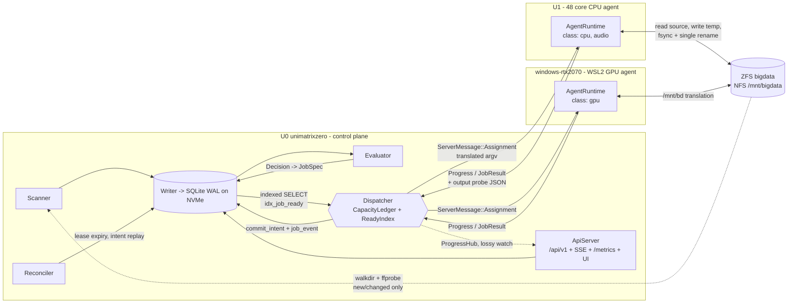
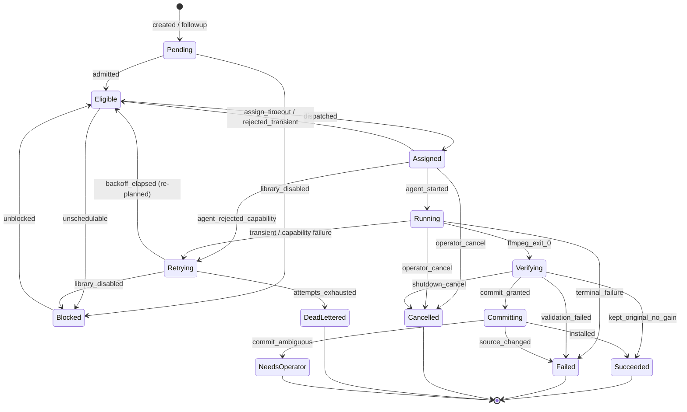

<!-- file: docs/design/distributed-architecture.md -->
<!-- version: 1.1.0 -->
<!-- guid: f15e2f8e-1e3b-4ac5-a124-9ce13a18ab26 -->
<!-- last-edited: 2026-07-31 -->

# transcodarr — Distributed Transcode Orchestrator

## Overview

`transcodarr` is a distributed media transcode orchestrator: one Rust binary that runs
as a control plane on the storage server, as an agent on every worker node, and as a
legacy single-file CLI escape hatch. It scans media libraries, stores probe facts in an
indexed embedded database, evaluates a typed policy against those stored facts, and
pushes capability-matched ffmpeg work to agents over a long-lived gRPC stream — then
validates and atomically commits the result with a durable intent ledger so a crash can
never leave a library file both un-replaced and un-recoverable.

### What it replaces, and why

It replaces Tdarr for a ~49.6k-file, ~85TB library across three ZFS datasets. The
replacement is not aesthetic; eight structural failures were measured directly:

1. **One Node.js event loop** shared by scanning, DB writes, queue sorting and dispatch.
   A 48-core node never kept more than ~8-11 workers fed regardless of configured slots.
2. **nedb with no indexes** — every operation was "getAll then filter in JS", with an
   fsync per write. Moving that datastore from HDD to NVMe was the single largest
   performance win of the entire engagement.
3. **Pull-based polling** at 400ms rather than server push.
4. **No node affinity** except as a paid feature, so the CPU-only node repeatedly grabbed
   GPU-only jobs, bounced them, and starved.
5. **A global staged-file limit** (default 100) that filled with jobs for a worker type
   with no capacity, permanently blocking every other class from being staged.
6. **Requeue-to-front** (smallest-first ordering plus a `bumped` flag) so bounced jobs
   returned instantly to the same incapable node — livelock.
7. **File state and job state conflated in one enum**, so a "fresh scan" dropped all
   records and re-probed from disk, and disabling a library did *not* stop dispatch
   because dispatch keyed off file state.
8. **Obfuscated JavaScript**, so none of the above was patchable.

Every one of those has a named structural answer here: task-per-concern ownership inside
the server, `STRICT` SQLite tables with a hot-path partial index, `rpc Connect` server
push, `fn satisfies(&Capability, &Requirements) -> Result<(), UnmetRequirement>` as the
only gate that can construct an `Assignment`, per-`(class, size_bucket)` staging with no
global limit, `order_key = max(orig + penalty, now_millis())` plus `excluded_agents_json`,
and separate `file.state` / `job.state` with `library.enabled` as the dispatch predicate.

### Shape of the solution

A single control plane owns all state and all decisions. Agents own no policy: they
report a freshly probed capability document at every registration, receive a fully
translated `argv` vector they exec without a shell, stream lossy progress and lossless
results back, and perform the commit ritual under a server-issued fencing token against
a `commit_intent` row and a locally fsynced `IntentJournal`. Decisions are made purely
from stored probe data — `fn evaluate(&FileFacts, &Policy) -> Decision` touches no
filesystem — so re-evaluating 49.6k files after a policy edit is seconds of CPU, not days
of ffprobe. The two-stage audio-then-video pipeline is emergent rather than encoded: the
agent returns the output's ffprobe, the server write-throughs it in the same transaction
that marks the job `Succeeded`, and the file's own audio codec becomes the marker that
makes the next evaluation yield video-only.

Concurrency is four independent limits held simultaneously — per-agent slot, cluster
global per class, cluster global large-file, and a pool-scoped byte reservation — all
plain counters inside a `CapacityLedger` owned exclusively by the single `Dispatcher`
task, so acquisition is all-or-nothing with no lock ordering and no partial-acquire
deadlock. Defaults trace to measurements: `global.video_gpu = 3` (NVENC aggregate fps
1=71, 2=101, 3=117), `agent.cpu.video_cpu = floor(effective_cores / threads_per_encode)`,
`agent.cpu.audio = 24`, `global.large = 3` against a 20 GiB threshold.

### Component inventory

| Crate | Owns | Never does |
| --- | --- | --- |
| `transcodarr-core` | `MediaProbe`, `FileFacts`, `Policy`/`Rule`/`Decision`, `Capability`/`Requirement`, `PathTranslator`, `EncodePlan`, `ValidationSpec`, `FailureClass` | any I/O; no tokio, rusqlite or tonic |
| `transcodarr-proto` | tonic-build output from `proto/transcodarr/v1/agent.proto`, plus `From`/`TryFrom` to core types | domain logic |
| `transcodarr-store` | `Db`, `Migrator`, `Writer`, `ReadPool`, the ten repositories, `StoreError` | policy decisions |
| `transcodarr-server` | `Dispatcher`, `CapacityLedger`, `ReadyIndex`, `Scanner`, `Evaluator`, `Reconciler`, `ScheduleEngine`, `ProgressHub`, `ApiServer` | run ffmpeg |
| `transcodarr-agent` | `CapabilityProber`, `TrialDecode`, `RenameProbe`, `Executor`, `OutputValidator`, `AtomicReplacer`, `CommitRitual`, `IntentJournal` | decide policy |
| `transcodarr-cli` | `Cli`, `Command::{Server, Agent, Local, Admin}` | anything else |

`transcodarr-core` is the correctness argument: server and agent link the *same*
`satisfies` and `validate_output`, so agent-side re-validation is a genuine detector of a
stale capability model rather than a second, subtly different implementation. Any
`JobRejected` increments `transcodarr_agent_rejections_total{agent,reason}` and is
alarmed as a server bug, never absorbed as a routine retry.



Media bytes never traverse the control plane. The server moves paths, argv and probe
JSON; agents move the files. Path translation is server-side and dispatch-time:
`Requirement::MountCovers(CanonicalPath)` makes an untranslatable path an ineligibility,
never a runtime failure — which matters because the same file is `/mnt/bigdata/...` on U0
and U1 but `/mnt/bd/...` inside WSL2.

The environment overrides that supersede any generic design: ZFS snapshots mean in-place
replacement reclaims nothing, so reclaim is read from `zfs used`/`usedbysnapshots` into
`pool_reclaim_sample` and a snapshot preflight gates commit; free space is reserved
against one server-assigned `PoolId`, never per mount or per agent; the DB location is
validated by a measured fsync-latency probe exported as
`transcodarr_db_fsync_latency_seconds`, not by fstype; each agent must pass a
rename-over-an-existing-open-destination probe before `agent.commit_eligible` is set; and
a cross-device work area is a hard dispatch gate (`BlockStage::WorkAreaCrossDevice`), not
a warning.

## Crate and Workspace Layout

### Root

The repository becomes a Cargo workspace. The single `src/main.rs` is dissolved; nothing is deleted, everything is relocated.

```
transcodarr/
  Cargo.toml                     # [workspace] only — virtual manifest
  Cargo.lock                     # committed (already is; .gitignore lies, leave it)
  clippy.toml  rustfmt.toml      # unchanged, apply workspace-wide
  crates/
    transcodarr-core/            # pure domain, no I/O
    transcodarr-proto/           # tonic/prost wire types + conversions
    transcodarr-store/           # rusqlite, migrations, Writer, repositories
    transcodarr-server/          # dispatcher, scanner, evaluator, api, ui, metrics
    transcodarr-agent/           # capability probing, ffmpeg exec, commit ritual
    transcodarr-cli/             # bin `transcodarr`: server|agent|local|admin
    transcodarr-testkit/         # dev-only harness (NAME NOT IN CONTRACT — added here)
    xtask/                       # `cargo xtask proto` codegen (added here)
  proto/transcodarr/v1/agent.proto
  migrations/NNNN_name.sql
  ui/                            # index.html, app.js, style.css, favicon.svg
  deploy/                        # systemd units, grafana dashboard, alerts.yml
  testdata/                      # unchanged, still Git LFS
  scripts/generate_test_media.py # unchanged
```

```toml
[workspace]
# file: Cargo.toml
# version: 1.0.0
# guid: <new uuid>
resolver = "2"
members  = ["crates/*"]

[workspace.package]
edition = "2021"
license = "MIT OR Apache-2.0"
rust-version = "1.76"            # promotes README prose to an enforced MSRV

[workspace.dependencies]
anyhow = "1"; thiserror = "2"; serde = { version = "1", features = ["derive"] }
serde_json = "1"; toml = "0.8"; blake3 = "1"; camino = { version = "1", features = ["serde1"] }
clap = { version = "4", features = ["derive"] }
tokio = { version = "1", features = ["rt-multi-thread","macros","process","signal","sync","fs","time"] }
tonic = { version = "0.12", features = ["tls"] }; prost = "0.13"; tonic-build = "0.12"
axum = "0.7"; tower-http = { version = "0.6", features = ["trace","compression-gzip"] }
rust-embed = { version = "8", features = ["debug-embed"] }
rusqlite = { version = "0.32", features = ["bundled","serde_json","blob","backup"] }
r2d2 = "0.8"; r2d2_sqlite = "0.25"
tracing = "0.1"; tracing-subscriber = { version = "0.3", features = ["json","env-filter"] }
metrics = "0.23"; metrics-exporter-prometheus = "0.15"
arc-swap = "1"; walkdir = "2"; rustls = "0.23"; humantime-serde = "1"
tempfile = "3"; criterion = { version = "0.5", features = ["html_reports"] }
```

The `json` feature is deleted; `serde` is unconditional everywhere. Note the workspace `Cargo.toml` header sits inside the `[workspace]` section per the TOML rule (the existing root file's top-of-file header is the thing being fixed).

### Layering

Dependencies point one way only, and CI enforces it with `cargo tree -i` assertions in `xtask`:

```
core  <-  proto  <-  store  <-  server
  ^         ^                     ^
  |         +--------- agent -----+
  +------------------- cli -------+   (cli -> core, server, agent, store)
```

`transcodarr-core` depends on **no** internal crate and on no async, DB, or network crate. `transcodarr-agent` depends on `core` + `proto` only — never on `store`; an agent must be scp-able to the WSL2 node without dragging SQLite along. `transcodarr-server` is the only crate that links `store`.

Every library crate opens with:

```rust
// file: crates/transcodarr-core/src/lib.rs
// version: 1.0.0
// guid: <new uuid>
#![deny(unsafe_code)]
#![warn(missing_docs)]
//! Pure domain model for transcodarr: probe facts, policy, capability
//! matching, encode plans, and output validation. No I/O, no async.
```

### transcodarr-core

The crown jewel and the entire unit-test surface. Modules: `probe`, `facts`, `policy`, `plan`, `capability`, `paths`, `validate`, `failure`, `job`, `preset`.

```rust
pub fn parse_ffprobe_json(raw: &str) -> Result<MediaProbe, CoreError>;
pub fn derive_facts(probe: &MediaProbe, size_bytes: u64) -> FileFacts;
pub fn content_sig(facts: &FileFacts) -> ContentSig;

pub fn evaluate(facts: &FileFacts, policy: &Policy) -> Decision;
pub fn evaluate_explained(facts: &FileFacts, policy: &Policy) -> (Decision, Vec<RuleTrace>);
pub fn rules_version(policy: &Policy) -> RulesVersion;   // blake3(canonical TOML)
pub fn next_job(d: &Decision, facts: &FileFacts) -> Option<JobSpec>;

pub fn satisfies(cap: &Capability, req: &Requirements) -> Result<(), UnmetRequirement>;
pub fn pix_fmt_for(enc: EncoderId, depth: BitDepth) -> PixFmt;   // exhaustive match
pub fn build_ffmpeg_argv(plan: &EncodePlan, paths: &JobPaths) -> Vec<String>;
pub fn validate_output(spec: &ValidationSpec, out: &MediaProbe, exit: i32,
                       bytes: u64) -> ValidationReport;
pub fn classify_failure(exit: i32, signal: Option<i32>, stderr_tail: &str)
                       -> (FailureClass, FailureCode);
pub fn size_bucket_for(bytes: u64, t: &SizeThresholds) -> SizeBucket;
impl JobState { pub fn can_transition(from: JobState, to: JobState) -> bool; }
impl PathTranslator {
    pub fn from_mounts(mounts: &[Mount]) -> Self;
    pub fn to_agent(&self, p: &CanonicalPath, pf: Platform) -> Result<AgentPath, CoreError>;
}
```

Because `satisfies` and `validate_output` live here, the server and the agent execute *literally the same bytes* for matching and validation — that is what makes agent-side re-validation a genuine bug detector rather than a second implementation that can drift.

### transcodarr-proto

`build.rs` runs `tonic_build` only when `TRANSCODARR_REGEN_PROTO=1`; otherwise it `include!`s checked-in generated code under `src/generated/transcodarr.v1.rs`. `protoc` is not installed on U0 and must not become a build dependency; `cargo xtask proto` regenerates using `protoc-bin-vendored` and CI asserts the committed output is byte-identical. Beyond generated types the crate hand-writes the boundary conversions, which is where wire laxity is turned into typed domain values:

```rust
impl TryFrom<pb::Capability> for transcodarr_core::Capability { type Error = ProtoError; }
impl From<transcodarr_core::Requirements> for pb::Requirements { }
impl TryFrom<pb::JobResult>  for transcodarr_core::Outcome     { type Error = ProtoError; }
pub const PROTO_VERSION: u32 = 1;
pub const MIN_SUPPORTED_PROTO: u32 = 1;
```

### transcodarr-store

Owns SQLite and nothing else. `Db::open` applies the pragma block, runs `Migrator` against embedded `include_str!` migrations, records `schema_migration`, and performs the startup fsync-latency probe (hard abort — fstype checking is useless in an all-ZFS environment). Public surface is `Db`, `Migrator`, `Writer`/`WriteOp`/`WriteLane`, `ReadPool`, `StoreError`, and the repositories named in the contract: `FileRepo`, `JobRepo`, `AgentRepo`, `LibraryRepo`, `ConfigRepo`, `ScheduleRepo`, `TrashRepo`, `CommitIntentRepo`, `DispatchBlockRepo`, `PoolRepo`.

```rust
impl Writer { pub fn submit(&self, lane: WriteLane, op: WriteOp) -> oneshot::Receiver<Result<WriteAck, StoreError>>; }
impl JobRepo {
    pub fn transition(&self, id: JobId, from: JobState, to: JobState,
                      reason: &str) -> Result<Transitioned, TransitionError>;   // CAS
}
```

Repositories return domain types from `transcodarr-core`, never `rusqlite::Row`. No SQL string escapes this crate — that is the structural guarantee against a "getAll then filter in JS" equivalent reappearing.

### transcodarr-server

Modules map one-to-one onto the process-model table: `dispatch` (`Dispatcher`, `CapacityLedger`, `ReadyIndex`, `RequirementBucket`, `EligibilityBitset`), `agents` (`AgentTable`, `AgentSession`), `scanner`, `evaluator`, `reconciler`, `schedule`, `pressure`, `progress`, `config`, `api`, `ui`, `metrics`. `#![deny(clippy::disallowed_types)]` with a module-scoped ban on `std::sync::Mutex`, `rusqlite::*` and `std::fs` inside `dispatch` — the single-owner dispatcher is a discipline property and discipline needs a lint.

The UI is `#[derive(RustEmbed)] #[folder = "../../ui/"]` with `debug-embed = false`, so debug builds serve from disk and release builds compile the assets in. `cargo build` alone yields a working server: no bundler, no `node_modules`.

### transcodarr-agent

`AgentRuntime`, `ConnectClient`, `CapabilityProber`, `TrialDecode`, `RenameProbe`, `CpuQuotaReader`, `Executor`, `FfmpegProcess`, `ProgressTailer`, `OutputValidator`, `AtomicReplacer`, `CommitRitual`, `IntentJournal`, `InflightJournal`, `WorkArea`, `TrashCan`, `Drainer`. This is the **only** crate permitted to call `std::fs::rename`, `remove_file`, or `remove_dir_all` on a media path, and only from `agent::fsops`; a CI grep test over the workspace fails the build on any other call site.

### transcodarr-cli

The one shipped binary, `[[bin]] name = "transcodarr" path = "src/main.rs"`.

```rust
#[derive(Subcommand)]
pub enum Command {
    Server(ServerArgs),
    Agent(AgentArgs),
    Local { #[command(subcommand)] cmd: LocalCommand },
    Admin { #[command(subcommand)] cmd: AdminCommand },
}
pub enum LocalCommand { Transcode(..), Batch(..), Info(..) }
pub enum AdminCommand { Diagnose, Explain, Queue, Trash, Config, Fsck, RollingUpgrade, Ca }
```

`admin` is a pure HTTP client of `/api/v1` — the 3am tool that works over SSH with no browser.

### Keeping the existing CLI working

This is a hard constraint, not a courtesy: `transcodarr local` is the escape hatch used when the orchestrator itself is broken.

**Argument compatibility.** The existing top-level verbs are preserved as an alias layer. `transcodarr transcode ...`, `batch ...` and `info ...` remain valid and are rewritten to `local <verb>` before clap parsing, via a `#[command(alias)]` on each `LocalCommand` variant plus a hidden pre-parse shim in `main`. Every flag keeps its current name, default and semantics, including `--input-exts "mp4,mkv,avi,mov,m4v,ts"` and the `_transcoded.<ext>` default output.

**Where today's code lands.**

| `src/main.rs` today | New home |
| --- | --- |
| `resolve_output_path`, `paths_equivalent`, `suffixed_output`, `strict_stem` | `core::paths` — moved verbatim, plus an explicit `base_dir: &Utf8Path` parameter replacing `env::current_dir()` |
| mirroring logic inside `batch_transcode` | `core::paths::plan_output_path(input, in_root, out_root, ext)` |
| `apply_preset` | `core::preset::PresetRegistry`; signature becomes `Option<EncoderId>` args, killing the `vcodec == "libx264"` sentinel, and unknown names now `bail!` instead of `_ => {}` |
| argv construction inside `transcode` | `core::plan::build_ffmpeg_argv` |
| `Command::new("ffmpeg")` with inherited stdio | `cli::local::run_ffmpeg` (kept, CLI-only) and, separately, `agent::Executor` (async, captured, `-progress` file) |
| `info` ffprobe invocation | `cli::local::info` printing; the JSON path now goes through `core::parse_ffprobe_json` |
| `collect_media_files` | `cli::local::collect_media_files`, verbatim. It performs I/O so it may not enter `core`; the server's `Scanner` gets its own `walkdir` implementation with symlink, depth and exclude-glob guards |
| `Cli`/`Commands`, `fn main`, all `println!` | `transcodarr-cli` |

**Tests and benches move with the binary.** `tests/` and `benches/` relocate to `crates/transcodarr-cli/`, because a virtual workspace root builds neither. `tests/common/mod.rs` needs exactly one change — `project_root()` walks up two extra levels from `CARGO_MANIFEST_DIR` — after which `binary_path()` still resolves `target/debug/transcodarr` (the workspace target dir stays at the repo root) and all sixteen tests compile unchanged. The duplicated helpers in `benches/transcode_benchmark.rs` are replaced by `transcodarr-testkit`, which both tests and benches may depend on as a dev-dependency.

**Two real bugs are fixed during extraction, not after.** `fs::create_dir_all` moves *below* the `if dry_run { continue; }` check so `--dry-run` no longer mutates the filesystem, and unknown preset names error. That takes the suite from 11/16 to 14/16; the remaining three failures are the LFS-pointer fixtures, resolved by having `testkit` invoke `scripts/generate_test_media.py` on demand and by reconciling the `..._aac.mkv` / `..._opus.mkv` naming mismatch in favour of what the generator actually produces.

**M1 exit criterion:** `cargo fmt -- --check`, `cargo clippy --all-targets --all-features -- -D warnings`, and `cargo test` all green across the six crates, with the `local` subcommand behaviourally identical to today's binary and the full R70 fixture set passing inside `transcodarr-core` with no network, no DB and no agent.

## Data Model

### Conventions

SQLite, one file, **`STRICT` tables everywhere** (verified on the 3.46 in this environment). STRICT permits only `INTEGER`, `REAL`, `TEXT`, `BLOB`, `ANY`, so booleans are `INTEGER NOT NULL CHECK(x IN (0,1))` and every timestamp is an explicit `*_unix` (seconds) or `*_unix_ms` (epoch millis, used only where dispatch latency is measured). Enums are `TEXT` with `CHECK` lists whose spellings match the `serde` representation of the corresponding `transcodarr-core` enum exactly — `JobState` is `PascalCase`, everything else is `snake_case`. JSON columns are suffixed `_json` and are never queried with `json_extract` on the hot path; anything the dispatcher, evaluator or UI filters on is promoted to a real column.

Boot pragmas, asserted by `Db::open` and re-asserted after each connection is handed out by `ReadPool`:

```sql
PRAGMA journal_mode = WAL;
PRAGMA synchronous  = NORMAL;      -- Writer raises to FULL for the Commit lane
PRAGMA foreign_keys = ON;
PRAGMA busy_timeout = 5000;
PRAGMA mmap_size    = 268435456;
PRAGMA wal_autocheckpoint = 0;     -- Writer checkpoints PASSIVE when idle
```

`synchronous` is per-connection, so `Writer` runs `PRAGMA synchronous=FULL` around `WriteLane::Commit` operations (`commit_intent` inserts/updates, probe write-through) and drops back to `NORMAL` for `Normal`/`Bulk` lanes. That is flaw B8's fix expressed in the schema layer.

**The central separation.** `file` and `file_stream` hold what we *know about the media* and are updated only by the scanner and by probe write-through. `job`, `job_event`, `job_attempt` hold *work in flight*. No column in `file` describes job progress, and no dispatch query reads `file.state`; eligibility is `library.enabled` AND `job.state='Eligible'`. Tdarr failure mode 7 is unrepresentable because there is no shared enum to conflate.

### Migrations, pools and libraries

```sql
CREATE TABLE schema_migration (
  version      INTEGER PRIMARY KEY,
  name         TEXT    NOT NULL,
  checksum     TEXT    NOT NULL,          -- blake3 of the .sql text
  applied_unix INTEGER NOT NULL
) STRICT;

CREATE TABLE storage_pool (
  id                  INTEGER PRIMARY KEY,
  name                TEXT    NOT NULL UNIQUE,   -- 'bigdata'
  dataset             TEXT    NOT NULL,          -- 'bigdata' or 'bigdata/media'
  kind                TEXT    NOT NULL CHECK(kind IN ('zfs','posix','other')),
  reserve_bytes       INTEGER NOT NULL DEFAULT 536870912000,   -- 500 GiB
  snapshot_policy_ok  INTEGER NOT NULL DEFAULT 0 CHECK(snapshot_policy_ok IN (0,1)),
  last_check_unix     INTEGER
) STRICT;

CREATE TABLE pool_reclaim_sample (
  id                    INTEGER PRIMARY KEY,
  pool_id               INTEGER NOT NULL REFERENCES storage_pool(id) ON DELETE CASCADE,
  at_unix               INTEGER NOT NULL,
  used_bytes            INTEGER NOT NULL,
  usedbysnapshots_bytes INTEGER NOT NULL,
  available_bytes       INTEGER NOT NULL,
  referenced_bytes      INTEGER NOT NULL
) STRICT;
CREATE INDEX idx_reclaim_pool_time ON pool_reclaim_sample(pool_id, at_unix DESC);

CREATE TABLE library (
  id                INTEGER PRIMARY KEY,
  name              TEXT    NOT NULL UNIQUE,
  root_path         TEXT    NOT NULL,            -- canonical: /mnt/bigdata/media/tv
  dataset           TEXT    NOT NULL,
  pool_id           INTEGER NOT NULL REFERENCES storage_pool(id),
  work_dir          TEXT    NOT NULL,            -- canonical, must resolve to same dataset
  trash_dir         TEXT    NOT NULL,
  exclude_globs_json TEXT   NOT NULL DEFAULT '[".zfs/**","**/@eaDir/**","**/lost+found/**"]',
  enabled           INTEGER NOT NULL DEFAULT 1 CHECK(enabled IN (0,1)),
  scan_cron         TEXT,
  scan_parallelism  INTEGER NOT NULL DEFAULT 2,
  priority          INTEGER NOT NULL DEFAULT 100,
  min_mtime_age_s   INTEGER NOT NULL DEFAULT 300,  -- B13: don't enqueue a file still being written
  created_unix      INTEGER NOT NULL,
  updated_unix      INTEGER NOT NULL
) STRICT;

CREATE TABLE scan_run (
  id              INTEGER PRIMARY KEY,
  library_id      INTEGER NOT NULL REFERENCES library(id) ON DELETE CASCADE,
  mode            TEXT    NOT NULL CHECK(mode IN ('quick','full','reconcile')),
  started_unix    INTEGER NOT NULL,
  finished_unix   INTEGER,
  status          TEXT    NOT NULL CHECK(status IN ('running','ok','aborted','failed')),
  scan_generation INTEGER NOT NULL,
  files_seen      INTEGER NOT NULL DEFAULT 0,
  files_new       INTEGER NOT NULL DEFAULT 0,
  files_changed   INTEGER NOT NULL DEFAULT 0,
  files_missing   INTEGER NOT NULL DEFAULT 0,
  probe_errors    INTEGER NOT NULL DEFAULT 0,
  aborted_reason  TEXT,
  duration_ms     INTEGER
) STRICT;
CREATE INDEX idx_scan_lib_time ON scan_run(library_id, started_unix DESC);
```

`scan_generation` is a monotonic counter per library. A scan bumps it, upserts every file it sees with the new value, and then treats `scan_generation < current` as missing — an idempotent upsert that never deletes a row and never discards `probe_json` (R9). The mass-missing guard (B18) compares the would-be-missing count against `files_seen` before writing anything.

### File facts

```sql
CREATE TABLE file (
  id                   INTEGER PRIMARY KEY,
  library_id           INTEGER NOT NULL REFERENCES library(id) ON DELETE CASCADE,
  canonical_path       TEXT    NOT NULL,
  path_hash            BLOB    NOT NULL,        -- blake3(canonical_path), 32 bytes
  size_bytes           INTEGER NOT NULL,
  mtime_unix           INTEGER NOT NULL,
  mtime_ns             INTEGER NOT NULL DEFAULT 0,
  inode                INTEGER,
  dev                  INTEGER,
  nlink                INTEGER NOT NULL DEFAULT 1,
  size_bucket          TEXT    NOT NULL CHECK(size_bucket IN ('small','medium','large')),
  content_sig          TEXT,                    -- blake3 of decision-relevant facts
  -- derived probe facts (promoted so no query ever parses probe_json)
  container            TEXT,
  duration_s           REAL,
  bitrate_bps          INTEGER,
  video_codec          TEXT,
  video_profile        TEXT,
  video_bit_depth      INTEGER,
  video_pix_fmt        TEXT,
  video_width          INTEGER,
  video_height         INTEGER,
  color_transfer       TEXT,
  color_primaries      TEXT,
  is_hdr               INTEGER NOT NULL DEFAULT 0 CHECK(is_hdr IN (0,1)),
  is_dovi              INTEGER NOT NULL DEFAULT 0 CHECK(is_dovi IN (0,1)),
  dovi_profile         INTEGER,                 -- 7 => excluded by default (B5)
  has_object_audio     INTEGER NOT NULL DEFAULT 0 CHECK(has_object_audio IN (0,1)),
  audio_codecs         TEXT,                    -- sorted deduped csv: 'eac3,truehd'
  audio_track_count    INTEGER NOT NULL DEFAULT 0,
  audio_bytes          INTEGER,                 -- B6: audio-stage shrink compares this
  subtitle_track_count INTEGER NOT NULL DEFAULT 0,
  probe_json           TEXT,
  probe_at_unix        INTEGER,
  probe_tool_version   TEXT,
  -- evaluation bookkeeping
  state                TEXT NOT NULL CHECK(state IN ('discovered','probing','probed',
                         'probe_failed','evaluated','processed','quarantined','missing')),
  decision             TEXT CHECK(decision IN ('none','audio','video','audio_then_video')),
  decision_reason      TEXT,
  eval_rules_version   TEXT,                    -- NULL => needs re-evaluation
  eval_at_unix         INTEGER,
  same_decision_streak INTEGER NOT NULL DEFAULT 0,
  quarantine_reason    TEXT,
  original_size_bytes  INTEGER,
  bytes_reclaimed      INTEGER NOT NULL DEFAULT 0,
  last_job_id          INTEGER,
  first_seen_unix      INTEGER NOT NULL,
  last_seen_unix       INTEGER NOT NULL,
  scan_generation      INTEGER NOT NULL
) STRICT;

CREATE UNIQUE INDEX idx_file_path        ON file(path_hash);
CREATE UNIQUE INDEX idx_file_ident       ON file(dev, inode) WHERE inode IS NOT NULL;
CREATE INDEX idx_file_needs_eval         ON file(library_id, id) WHERE eval_rules_version IS NULL;
CREATE INDEX idx_file_dispatchable       ON file(library_id, decision, id)
                                         WHERE decision IS NOT NULL AND decision <> 'none';
CREATE INDEX idx_file_lib_state          ON file(library_id, state);
CREATE INDEX idx_file_scan_gen           ON file(library_id, scan_generation);
CREATE INDEX idx_file_audio_codecs       ON file(audio_codecs);
CREATE INDEX idx_file_video_codec        ON file(video_codec, video_bit_depth);
CREATE INDEX idx_file_size               ON file(library_id, size_bytes DESC);

CREATE TABLE file_stream (
  file_id          INTEGER NOT NULL REFERENCES file(id) ON DELETE CASCADE,
  stream_index     INTEGER NOT NULL,
  kind             TEXT NOT NULL CHECK(kind IN ('video','audio','subtitle','attachment','data')),
  codec            TEXT,
  profile          TEXT,
  channels         INTEGER,
  channel_layout   TEXT,
  bit_depth        INTEGER,
  sample_rate      INTEGER,
  bit_rate_bps     INTEGER,
  frame_count      INTEGER,
  language         TEXT,
  title            TEXT,
  is_default       INTEGER NOT NULL DEFAULT 0 CHECK(is_default IN (0,1)),
  is_forced        INTEGER NOT NULL DEFAULT 0 CHECK(is_forced IN (0,1)),
  disposition_json TEXT,
  PRIMARY KEY (file_id, stream_index)
) STRICT;
CREATE INDEX idx_stream_codec ON file_stream(kind, codec);

CREATE TABLE file_skip_marker (
  file_id        INTEGER NOT NULL REFERENCES file(id) ON DELETE CASCADE,
  decision_class TEXT    NOT NULL CHECK(decision_class IN ('audio','video')),
  rules_version  TEXT    NOT NULL,
  reason         TEXT    NOT NULL,   -- 'no_gain' | 'hardlinked' | 'dovi_p7' | 'object_audio'
  at_unix        INTEGER NOT NULL,
  PRIMARY KEY (file_id, decision_class, rules_version)
) STRICT;
```

`file_skip_marker` is keyed per **decision class**, not per file, which is flaw A3's fix: an audio stage that legitimately grew the file marks only `('audio', v)` skipped and the video stage still runs. The composite PK also makes the marker automatically expire when `rules_version` changes, matching R10.

### Job state

```sql
CREATE TABLE job (
  id                     INTEGER PRIMARY KEY,
  file_id                INTEGER NOT NULL REFERENCES file(id) ON DELETE CASCADE,
  library_id             INTEGER NOT NULL REFERENCES library(id) ON DELETE CASCADE,
  class                  TEXT NOT NULL CHECK(class IN ('audio','video_gpu','video_cpu','probe','verify')),
  size_bucket            TEXT NOT NULL CHECK(size_bucket IN ('small','medium','large')),
  state                  TEXT NOT NULL CHECK(state IN ('Pending','Blocked','Eligible','Assigned',
                            'Running','Verifying','Committing','Retrying','Succeeded','Failed',
                            'Cancelled','DeadLettered','NeedsOperator')),
  priority               INTEGER NOT NULL DEFAULT 100,
  order_key              INTEGER NOT NULL,        -- epoch ms; requeue = max(orig+penalty, now)
  requirements_json      TEXT NOT NULL,
  requirements_bucket_key TEXT NOT NULL,          -- categorical only; no paths, no byte thresholds
  plan_json              TEXT NOT NULL,
  expected_content_sig   TEXT NOT NULL,           -- A1: agent aborts if the file changed
  rules_version          TEXT NOT NULL,
  attempt                INTEGER NOT NULL DEFAULT 0,
  max_attempts           INTEGER NOT NULL DEFAULT 3,
  agent_id               TEXT REFERENCES agent(id),
  fencing_epoch          INTEGER,
  lease_expires_unix     INTEGER,
  not_before_unix        INTEGER NOT NULL DEFAULT 0,
  excluded_agents_json   TEXT NOT NULL DEFAULT '[]',
  parent_job_id          INTEGER REFERENCES job(id),
  input_bytes            INTEGER,
  output_bytes           INTEGER,
  terminal_reason        TEXT,
  created_unix           INTEGER NOT NULL,
  updated_unix           INTEGER NOT NULL,
  started_unix           INTEGER,
  finished_unix          INTEGER
) STRICT;

CREATE INDEX idx_job_ready ON job(class, size_bucket, not_before_unix, priority, order_key)
  WHERE state = 'Eligible';
CREATE UNIQUE INDEX idx_job_open_per_file ON job(file_id) WHERE state IN
  ('Pending','Blocked','Eligible','Assigned','Running','Verifying','Committing','Retrying');
CREATE INDEX idx_job_lease  ON job(lease_expires_unix)
  WHERE state IN ('Assigned','Running','Verifying','Committing');
CREATE INDEX idx_job_agent  ON job(agent_id, state);
CREATE INDEX idx_job_file   ON job(file_id, id DESC);
CREATE INDEX idx_job_state  ON job(state, class, size_bucket);
CREATE INDEX idx_job_bucket ON job(requirements_bucket_key, order_key) WHERE state = 'Eligible';
CREATE INDEX idx_job_dead   ON job(terminal_reason, finished_unix DESC) WHERE state = 'DeadLettered';
CREATE INDEX idx_job_backoff ON job(not_before_unix) WHERE state = 'Retrying';

CREATE TABLE job_event (
  id          INTEGER PRIMARY KEY,
  job_id      INTEGER NOT NULL REFERENCES job(id) ON DELETE CASCADE,
  at_unix_ms  INTEGER NOT NULL,
  from_state  TEXT,
  to_state    TEXT NOT NULL,
  agent_id    TEXT,
  attempt     INTEGER,
  reason_code TEXT NOT NULL,
  detail      TEXT
) STRICT;
CREATE INDEX idx_event_job  ON job_event(job_id, id);
CREATE INDEX idx_event_time ON job_event(at_unix_ms);

CREATE TABLE job_attempt (
  job_id              INTEGER NOT NULL REFERENCES job(id) ON DELETE CASCADE,
  attempt             INTEGER NOT NULL,
  agent_id            TEXT NOT NULL,
  agent_uid           TEXT NOT NULL,
  fencing_epoch       INTEGER NOT NULL,
  argv_json           TEXT NOT NULL,       -- exact translated argv, written BEFORE exec
  decode_strategy_json TEXT,
  started_unix_ms     INTEGER,
  finished_unix_ms    INTEGER,
  exit_code           INTEGER,
  signal              INTEGER,
  failure_class       TEXT CHECK(failure_class IN
                        ('Transient','Terminal','Capability','Validation','Cancelled')),
  failure_code        TEXT,
  stderr_tail         TEXT,                -- last 8 KiB
  progress_summary_json TEXT,
  validation_json     TEXT,
  output_probe_json   TEXT,
  input_bytes         INTEGER,
  output_bytes        INTEGER,
  PRIMARY KEY (job_id, attempt)
) STRICT;
CREATE INDEX idx_attempt_failure ON job_attempt(failure_class, failure_code, agent_id);
```

`idx_job_open_per_file` is the structural anti-double-dispatch guarantee: two concurrent ffmpeg processes racing a rename on one file is a constraint violation, not a race we hope not to lose. All transitions go through one compare-and-swap `UPDATE job SET state=?to ... WHERE id=? AND state=?from`, so a lost race returns `rows_affected = 0` and surfaces as `TransitionError`.

### Commit durability

```sql
CREATE TABLE commit_intent (
  id                   INTEGER PRIMARY KEY,
  job_id               INTEGER NOT NULL REFERENCES job(id) ON DELETE CASCADE,
  attempt              INTEGER NOT NULL,
  agent_id             TEXT    NOT NULL REFERENCES agent(id),
  agent_uid            TEXT    NOT NULL,
  boot_id              TEXT    NOT NULL,
  fencing_epoch        INTEGER NOT NULL,
  pool_id              INTEGER NOT NULL REFERENCES storage_pool(id),
  source_path          TEXT    NOT NULL,
  source_dev           INTEGER NOT NULL,
  source_inode         INTEGER NOT NULL,
  temp_path            TEXT    NOT NULL,
  final_path           TEXT    NOT NULL,
  trash_path           TEXT    NOT NULL,
  phase                TEXT    NOT NULL CHECK(phase IN ('granted','retired','installed')),
  state                TEXT    NOT NULL CHECK(state IN ('live','committed','rolled_back',
                                                        'needs_operator')),
  expected_content_sig TEXT    NOT NULL,
  created_unix_ms      INTEGER NOT NULL,
  updated_unix_ms      INTEGER NOT NULL,
  resolved_unix_ms     INTEGER,
  resolution           TEXT
) STRICT;
CREATE UNIQUE INDEX idx_intent_live ON commit_intent(source_dev, source_inode) WHERE state = 'live';
CREATE INDEX idx_intent_agent_live  ON commit_intent(agent_id, agent_uid, boot_id) WHERE state = 'live';
CREATE UNIQUE INDEX idx_intent_job_attempt ON commit_intent(job_id, attempt);

CREATE TABLE trash_entry (
  id               INTEGER PRIMARY KEY,
  file_id          INTEGER REFERENCES file(id) ON DELETE SET NULL,
  job_id           INTEGER,
  original_path    TEXT    NOT NULL,
  trash_path       TEXT    NOT NULL,
  pool_id          INTEGER NOT NULL REFERENCES storage_pool(id),
  size_bytes       INTEGER NOT NULL,
  at_unix          INTEGER NOT NULL,
  purge_after_unix INTEGER NOT NULL,
  restored_unix    INTEGER
) STRICT;
CREATE INDEX idx_trash_purge ON trash_entry(purge_after_unix) WHERE restored_unix IS NULL;
CREATE INDEX idx_trash_pool  ON trash_entry(pool_id, at_unix);
```

`idx_intent_live` is the ledger's teeth: **one live intent per (dev, inode)**, so two agents cannot both be mid-replace on the same physical file even if the job table were somehow inconsistent. `idx_intent_agent_live` scopes recovery to the owning agent's namespace (A10/A11) — the reconciler never sweeps a shared root.

### Agents and operations

```sql
CREATE TABLE agent (
  id                   TEXT PRIMARY KEY,        -- 'u1', 'win-rtx2070'
  agent_uid            TEXT NOT NULL,           -- per-install uuid, namespaces work dirs
  boot_id              TEXT,
  hostname             TEXT, platform TEXT, arch TEXT,
  agent_version        TEXT, proto_version INTEGER,
  ffmpeg_version       TEXT, ffprobe_version TEXT, driver_version TEXT,
  classes_json         TEXT NOT NULL,
  capability_json      TEXT NOT NULL,
  capability_hash      TEXT NOT NULL,
  effective_cores      REAL, physical_cores INTEGER,
  mounts_json          TEXT NOT NULL,
  rename_probe_status  TEXT NOT NULL DEFAULT 'untested'
                         CHECK(rename_probe_status IN ('untested','ok','failed')),
  commit_eligible      INTEGER NOT NULL DEFAULT 0 CHECK(commit_eligible IN (0,1)),
  fencing_epoch        INTEGER NOT NULL DEFAULT 0,
  status               TEXT NOT NULL CHECK(status IN
                         ('Online','Draining','Unhealthy','Offline','Quarantined')),
  admin_state          TEXT NOT NULL DEFAULT 'Enabled'
                         CHECK(admin_state IN ('Enabled','Paused','Drain')),
  quarantine_reason    TEXT,
  connected_since_unix INTEGER, last_register_unix INTEGER,
  last_heartbeat_unix  INTEGER, lease_expires_unix INTEGER
) STRICT;
CREATE INDEX idx_agent_status ON agent(status, admin_state);

CREATE TABLE agent_mount (
  agent_id            TEXT NOT NULL REFERENCES agent(id) ON DELETE CASCADE,
  canonical_prefix    TEXT NOT NULL,      -- '/mnt/bigdata'
  local_path          TEXT NOT NULL,      -- '/mnt/bd' on the WSL2 node
  pool_id             INTEGER REFERENCES storage_pool(id),
  fstype              TEXT,
  free_bytes          INTEGER, total_bytes INTEGER,
  writable            INTEGER NOT NULL DEFAULT 1 CHECK(writable IN (0,1)),
  workarea_same_device INTEGER NOT NULL DEFAULT 0 CHECK(workarea_same_device IN (0,1)),
  observed_unix       INTEGER NOT NULL,
  PRIMARY KEY (agent_id, canonical_prefix)
) STRICT;

CREATE TABLE agent_capability_history (
  id INTEGER PRIMARY KEY,
  agent_id TEXT NOT NULL REFERENCES agent(id) ON DELETE CASCADE,
  at_unix INTEGER NOT NULL, capability_hash TEXT NOT NULL, capability_json TEXT NOT NULL,
  agent_version TEXT, ffmpeg_version TEXT, driver_version TEXT,
  diff_summary TEXT                       -- '-hevc_nvenc, -nvdec:av1'
) STRICT;
CREATE INDEX idx_caphist ON agent_capability_history(agent_id, at_unix DESC);

CREATE TABLE agent_capability_override (
  agent_id     TEXT NOT NULL REFERENCES agent(id) ON DELETE CASCADE,
  requirement  TEXT NOT NULL,              -- serialized Requirement
  allowed      INTEGER NOT NULL CHECK(allowed IN (0,1)),
  reason       TEXT NOT NULL,
  evidence     TEXT,                       -- 'exit 69, 1KB output, job 88213'
  at_unix      INTEGER NOT NULL,
  expires_unix INTEGER,                    -- NULL = until cleared (C8: overrides expire)
  PRIMARY KEY (agent_id, requirement)
) STRICT;
CREATE INDEX idx_capovr_expiry ON agent_capability_override(expires_unix)
  WHERE expires_unix IS NOT NULL;

CREATE TABLE dispatch_block (
  job_id         INTEGER PRIMARY KEY REFERENCES job(id) ON DELETE CASCADE,
  at_unix        INTEGER NOT NULL,
  blocking_stage TEXT NOT NULL,            -- BlockStage, snake_cased
  detail_json    TEXT NOT NULL             -- per-agent UnmetRequirement list
) STRICT;
CREATE INDEX idx_block_stage ON dispatch_block(blocking_stage, at_unix DESC);

CREATE TABLE config_revision (
  id INTEGER PRIMARY KEY, at_unix INTEGER NOT NULL, actor TEXT,
  source TEXT NOT NULL CHECK(source IN ('file','api','bootstrap')),
  rules_version TEXT NOT NULL, toml TEXT NOT NULL, note TEXT
) STRICT;

CREATE TABLE schedule_window (
  id INTEGER PRIMARY KEY, name TEXT NOT NULL,
  enabled INTEGER NOT NULL DEFAULT 1 CHECK(enabled IN (0,1)),
  days_mask INTEGER NOT NULL,              -- bit 0 = Monday
  start_minute INTEGER NOT NULL CHECK(start_minute BETWEEN 0 AND 1439),
  end_minute   INTEGER NOT NULL CHECK(end_minute BETWEEN 0 AND 1439),
  priority INTEGER NOT NULL DEFAULT 100,
  overrides_json TEXT NOT NULL
) STRICT;
CREATE INDEX idx_window_enabled ON schedule_window(enabled, priority DESC);

CREATE TABLE schedule_override (
  id INTEGER PRIMARY KEY,
  scope TEXT NOT NULL,                     -- 'global' | 'agent:<id>'
  class TEXT, slots INTEGER NOT NULL,
  expires_unix INTEGER NOT NULL,           -- mandatory expiry, no permanent mysteries
  actor TEXT, reason TEXT, created_unix INTEGER NOT NULL
) STRICT;
CREATE INDEX idx_override_expiry ON schedule_override(expires_unix);
```

### Index catalogue

| Index | Query it serves |
|---|---|
| `idx_file_path` | Scanner upsert: `SELECT id,size_bytes,mtime_ns,inode FROM file WHERE path_hash=?` — the only per-file lookup in a 29.4k-file scan. |
| `idx_file_ident` | `(dev,inode)` identity for hardlink and rename detection (B7); also the reconciler's "which file is this intent about". |
| `idx_file_needs_eval` | `Evaluator`: keyset page `WHERE library_id=? AND eval_rules_version IS NULL AND id>? ORDER BY id LIMIT 1000`. Partial, so it is empty (and free) once evaluation converges. |
| `idx_file_dispatchable` | Planner: files with actionable decisions and no open job. |
| `idx_file_lib_state` | UI counts by state; `/diagnose` "eligible work exists" check. |
| `idx_file_scan_gen` | Missing-file reconcile `WHERE library_id=? AND scan_generation<?`. |
| `idx_file_audio_codecs`, `idx_file_video_codec` | Policy dry-run diff and the Files search filters (`audio_codecs LIKE '%truehd%'`, `video_codec=? AND video_bit_depth=?`). |
| `idx_file_size` | Largest-files UI view and large-bucket capacity estimation. |
| `idx_stream_codec` | Per-track policy questions ("how many Opus tracks exist") without touching `probe_json`. |
| `idx_job_ready` | **The dispatcher's only query.** `WHERE state='Eligible' AND class=? AND size_bucket=? AND not_before_unix<=? ORDER BY priority, order_key LIMIT k`. Column order matches the WHERE/ORDER BY exactly so it is a covering range scan with no sort. |
| `idx_job_bucket` | `QueueFeeder` hydrating `RequirementBucket` partitions by `requirements_bucket_key`. |
| `idx_job_open_per_file` | Enforcement, not lookup: makes double-dispatch a constraint error. |
| `idx_job_lease` | `Reconciler` 5s tick: `WHERE lease_expires_unix < ? AND state IN (...)`. |
| `idx_job_backoff` | `LeaseTimer` rehydration of `Retrying` jobs whose backoff elapsed. |
| `idx_job_agent` | Agent detail page, drain progress, and releasing permits on disconnect. |
| `idx_job_file` | Job history for one file (`/files/{id}/explain`), newest first. |
| `idx_job_state` | `transcodarr_queue_depth{state,class,size_bucket}` gauge refresh — one grouped scan. |
| `idx_job_dead` | Dead-letter view grouped by `terminal_reason`. |
| `idx_event_job` / `idx_event_time` | Job timeline render; nightly retention prune by age. |
| `idx_attempt_failure` | Capability-drift analysis: which agent fails which `failure_code`. |
| `idx_intent_live` | Uniqueness enforcement plus `transcodarr_commit_intents_live`. |
| `idx_intent_agent_live` | Agent-scoped crash recovery on reconnect. |
| `idx_intent_job_attempt` | `ReportCommit` idempotency lookup. |
| `idx_trash_purge` | Reaper: `WHERE purge_after_unix<? AND restored_unix IS NULL`. |
| `idx_trash_pool` | Trash bytes per pool for space-pressure early reaping. |
| `idx_agent_status` | Dispatcher cold-start hydration and the agents view. |
| `idx_caphist` | "What changed on this agent" page, newest first. |
| `idx_capovr_expiry` | Sweeping expired negative capabilities so a transient GPU fault is not permanent. |
| `idx_block_stage` | `transcodarr_dispatch_blocked_total{stage}` and the Queue view's inline reason column. |
| `idx_reclaim_pool_time` | Latest ZFS accounting sample for `transcodarr_pool_reclaim_effective_bytes`. |
| `idx_window_enabled`, `idx_override_expiry` | `ScheduleEngine`'s 30s recompute of `EffectiveLimits`. |

### Retention

Nightly, in `WriteLane::Bulk`: delete `job_event`/`job_attempt` for terminal jobs finished more than `retention.job_history_days` (default 90) ago, **except** `DeadLettered`, which is kept until an operator clears it; delete `pool_reclaim_sample` older than 400 days; delete `scan_run` rows older than 90 days. `commit_intent` rows are never deleted while `state='live'` and are retained for 1 year once resolved — they are the audit trail for R51. `VACUUM INTO` a timestamped backup nightly, keep 7.

## Job State Machine

`JobState` is the single authority on work-in-flight. It never encodes anything about the file itself — that is `FileState` — and it is never consulted to decide library eligibility (Tdarr failure mode 7). It is defined once, in `transcodarr-core`, and both the server and the agent link the same enum.

```rust
// crates/transcodarr-core/src/job/state.rs
#[non_exhaustive]
#[derive(Copy, Clone, Debug, PartialEq, Eq, Hash, Serialize, Deserialize)]
pub enum JobState {
    Pending, Blocked, Eligible, Assigned, Running, Verifying, Committing,
    Retrying, Succeeded, Failed, Cancelled, DeadLettered, NeedsOperator,
}

impl JobState {
    /// Terminal rows are immutable: nothing in the system may UPDATE them.
    pub const fn is_terminal(self) -> bool;
    /// Rows counted by `idx_job_open_per_file` — at most one per file.
    pub const fn is_open(self) -> bool;
    /// The *admitted set*. While in it, the job holds `AcquiredPermits`.
    /// Permits are released on LEAVING this set, not on reaching a terminal (A8).
    pub const fn holds_permits(self) -> bool {
        matches!(self, Self::Assigned | Self::Running | Self::Verifying | Self::Committing)
    }
    /// Exhaustive match. Adding a variant without handling it is a compile error.
    pub const fn can_transition(from: Self, to: Self) -> bool;
}
```

### Grouping

| Group | States | Property |
|---|---|---|
| Queued | `Pending`, `Blocked`, `Eligible`, `Retrying` | durable only; no permits, no agent, no filesystem effects |
| Admitted | `Assigned`, `Running`, `Verifying`, `Committing` | holds `AgentSlotPermit` + `ClassPermit` + optional `LargeFilePermit` + `SpaceReservation`; has `agent_id`, `fencing_epoch`, `lease_expires_unix` |
| Terminal | `Succeeded`, `Failed`, `Cancelled`, `DeadLettered`, `NeedsOperator` | immutable; operator "retry" inserts a **new** row with `parent_job_id` |

`Committing` is the only state in which media on disk is being mutated, and it is the only state with a live `commit_intent` row. `NeedsOperator` exists so that an ambiguous commit is never auto-resolved by a guess.

### Transition ledger and compare-and-swap

Every transition is a compare-and-swap inside one `Writer` transaction that also appends `job_event`. A lost race is a no-op, never a corruption.

```sql
UPDATE job
   SET state = :to, updated_unix = :now,
       agent_id = COALESCE(:agent_id, agent_id),
       attempt = :attempt,
       lease_expires_unix = :lease,
       not_before_unix = :not_before,
       terminal_reason = :terminal_reason,
       finished_unix = CASE WHEN :is_terminal THEN :now ELSE finished_unix END
 WHERE id = :job_id AND state = :from;
-- rows_affected == 0  =>  re-SELECT state and return TransitionError::Lost

INSERT INTO job_event (job_id, at_unix_ms, from_state, to_state, agent_id, attempt,
                       reason_code, detail)
VALUES (:job_id, :now_ms, :from, :to, :agent_id, :attempt, :reason_code, :detail);
```

```rust
// transcodarr-store
impl JobRepo {
    pub fn transition(&self, tx: &Transaction<'_>, t: &Transition)
        -> Result<(), TransitionError>;
}

#[non_exhaustive]
pub enum TransitionError {
    Illegal { from: JobState, to: JobState },
    Lost { expected: JobState, actual: JobState },
    TerminalImmutable { state: JobState },
    FencingStale { expected: FencingEpoch, got: FencingEpoch },
    Store(StoreError),
}
```

The `job.state` CHECK constraint carries all thirteen variants (the base schema predates `Committing` and `NeedsOperator`; migration `0002_commit_intent.sql` widens it). `idx_job_open_per_file` covers exactly `is_open()`, so a second job for the same file is structurally impossible while any attempt is alive.

### Full transition table

| From | To | Trigger | `reason_code` |
|---|---|---|---|
| — | `Pending` | `Planner` from a `Decision`; `derive_followup_job()` after an audio stage commits; operator retry of a terminal row | `created`, `followup`, `operator_retry` |
| `Pending` | `Eligible` | requirements + `EncodePlan` built, library enabled, `mtime` older than `library.min_mtime_age_s` (B13) | `admitted` |
| `Pending` | `Blocked` | library disabled, no agent class configured that could ever match, source too fresh | `library_disabled`, `agent_class_absent`, `source_too_fresh` |
| `Blocked` | `Eligible` | `DispatchEvent::{AgentConnected, ConfigApplied, BucketCreated, ScheduleTick}`; ≤1s after library re-enable (R12) | `unblocked` |
| `Eligible` | `Blocked` | `dispatch_block.blocking_stage = NoAgentWithCapability` persisted for `unschedulable_after` (default 15m), or library disabled mid-queue (D8) | `unschedulable`, `library_disabled` |
| `Eligible` | `Assigned` | `Dispatcher::commit_assignment` — permits acquired, argv persisted to `job_attempt` **before** the offer is sent | `dispatched` |
| `Assigned` | `Running` | `AgentMessage::JobStarted` (pid + echoed argv, which must equal what was sent) | `agent_started` |
| `Assigned` | `Eligible` | no `JobAccepted` within `assign_ack_timeout` (30s), or `try_send` to the agent channel failed (A7) | `assign_timeout`, `offer_undeliverable` |
| `Assigned` | `Retrying` | `JobRejected` with a capability-drift reason: writes `agent_capability_override`, adds the agent to `excluded_agents_json`, bumps `transcodarr_agent_rejections_total` — **alarmed as a server bug** | `agent_rejected_capability` |
| `Assigned` | `Eligible` | `JobRejected` with a transient reason (busy, draining): never excludes, never dead-letters (A13) | `agent_rejected_transient` |
| `Running` | `Verifying` | ffmpeg exit 0, no signal | `ffmpeg_exit_0` |
| `Running` | `Retrying` | `FailureClass::Transient` — backoff via `not_before_unix = now + min(30s·2^(n-1), 30m) ± 50%` | `transient_failure` |
| `Running` | `Retrying` | `FailureClass::Capability` (`HwDecodeUnsupported`, `HwEncodeUnavailable`) — no backoff, agent excluded, override written | `capability_failure` |
| `Running` | `Retrying` | `EncoderSessionExhausted` — transient, sheds one GPU slot, **no** override (C8) | `encoder_sessions_exhausted` |
| `Running` | `Failed` | `FailureClass::Terminal` (`InputUnreadable`, `InvalidPixFmt`) | `terminal_failure` |
| `Verifying` | `Committing` | all `ValidationGate`s except `Size` passed and `CommitIntentRepo::open()` inserted a live intent at `IntentPhase::Granted` | `commit_granted` |
| `Verifying` | `Succeeded` | valid output but fails the per-stage size gate — temp deleted, original untouched, `file_skip_marker` written for that `DecisionClass` (A3/B6) | `kept_original_no_gain` |
| `Verifying` | `Failed` | any of `ExitCode`/`Probe`/`Duration`/`StreamCounts`/`EmptyStream`/`DecodeNull` failed; temp deleted | `validation_failed:<gate>` |
| `Committing` | `Succeeded` | `ReportCommit` with a valid `FencingToken`; same `synchronous=FULL` transaction rewrites `file`/`file_stream` from `output_probe_json`, inserts `trash_entry`, resolves the intent `Installed` (R11, B8) | `installed` |
| `Committing` | `Failed` | pre-rename re-stat of the source shows changed `dev/ino/size/mtime_ns` (B3); intent rolled back, temp deleted, `file.eval_rules_version = NULL` so a fresh plan is derived | `source_changed` |
| `Committing` | `NeedsOperator` | reconciliation cannot prove roll-forward or roll-back | `commit_ambiguous` |
| `Retrying` | `Eligible` | `not_before_unix` elapsed **and** the job was re-planned from current stored facts — `plan_json` and `expected_content_sig` are rewritten, never reused (A1/A2/D2) | `backoff_elapsed` |
| `Retrying` | `Eligible` | unmatched for `relax_after` (default 20m): re-plan against the next encoder in preference order (B12) | `encoder_relaxed` |
| `Retrying` | `Blocked` | library disabled during backoff | `library_disabled` |
| `Retrying` | `DeadLettered` | `attempt >= max_attempts` | `attempts_exhausted` |
| any open | `Cancelled` | operator `POST /api/v1/jobs/{id}/cancel`, or drain grace expiry | `operator_cancel`, `shutdown_cancel` |

`order_key` on any return to the queue is `max(original_order_key + penalty(attempt), now_millis())` — literally the back of the queue, with no `bumped` flag and no smallest-first sort anywhere (Tdarr failure mode 6 is unrepresentable). Note that `requeue_job()` and `derive_followup_job()` are deliberately **different functions** with no shared code path (T5).



### Server crash

`Reconciler::reconcile_startup()` runs to completion **before the first dispatch pass** (C4), in this order:

1. Rebuild `CapacityLedger` by summing every row where `holds_permits()` is true. Skipping this double-commits capacity.
2. Enter a `recovery_grace` window (default 90s, ≥ `lease_seconds`) during which leases are **not** expired, so a reconnecting agent can re-claim its work instead of having it duplicated (D5).
3. Resolve every live `commit_intent` before touching the owning jobs.

Per state:

- `Pending` / `Blocked` / `Eligible` / `Retrying` / terminal — durable, untouched.
- `Assigned` — the agent may never have received the `Assignment`. If `Hello.running_job_ids` contains it, transition to `Running`; if grace expires without a claim, `assign_timeout` back to `Eligible` and queue a `CleanupTemp` for that agent.
- `Running` / `Verifying` — re-adopted from `Hello.running_job_ids`; the agent's `ProgressTailer` resumes reading the progress file. Unclaimed after grace: `Retrying` with `FailureCode::AgentLost`.
- `Committing` — resolved **only** from the `commit_intent` ledger plus the agent's replayed `IntentJournal`, scoped to the owning `agent_uid`/`boot_id`, never by a shared-root sweep (A11) and never by spec resemblance (B9):

| `IntentPhase` | On-disk truth | Resolution |
|---|---|---|
| `Granted` | nothing renamed | roll back: delete temp, `Retrying` (re-plan) or `Failed`; `resolution='rolled_back'` |
| `Retired` | original in trash, final path empty | roll forward if the temp still validates, else restore from `trash_path`; `resolution='rolled_forward'` / `'restored'` |
| `Installed` | rename done, ack lost | verify final path probes to the recorded output; `Succeeded` with write-through; `resolution='confirmed'` |
| any | source absent, no trash entry, no valid temp | `NeedsOperator`; `resolution='escalated'` |

Each resolution increments `transcodarr_commit_intent_recovered_total{resolution}`; `transcodarr_commit_intents_live` and `transcodarr_needs_operator_current` are exported continuously.

### Agent crash

The server sees a stream close or a missed lease. Stream close is treated as immediate lease expiry (faster than TTL); leases are computed in **server time from server-observed arrivals**, so WSL2 clock drift cannot expire a healthy lease. `Reconciler` then, per job: release permits (leaving the admitted set), append `job_event{reason_code:'lease_expired'}`, and move `Assigned`/`Running`/`Verifying` to `Retrying` with `FailureCode::AgentLost` (transient, consumes an attempt). `Committing` jobs are **never** auto-requeued while a live intent exists — they wait for intent resolution, because the replace window may be half-done. `transcodarr_orphans_reconciled_total{kind}` counts leases, temps and intents separately. After `agent.circuit_breaker_failures` consecutive failures with zero successes the agent is `Quarantined` and its jobs are excluded from it (B17).

### Agent reconnect

The agent replays its fsynced `IntentJournal` and `InflightJournal` **before** sending `Hello` and before accepting any work. `Hello` carries `capability_hash` and `running_job_ids`; `Welcome` returns `unknown_job_ids`, which the agent kills and cleans. `FencingEpoch` bumps only on a **new process instance** — a stream reconnect resumes the existing epoch (C9) — and any `ReportCommit` bearing a stale epoch is rejected with `TransitionError::FencingStale`, leaving the job untouched and the agent quarantined. A job whose `job_id` the agent already believes it is running is refused outright; temp paths are `job_id + attempt + agent_uid` scoped so a re-dispatch can never collide with a survivor (B14).

## Agent Protocol

One unary RPC for the handshake and one long-lived bidirectional stream for everything else. A single stream means connection liveness *is* agent liveness, ordering is guaranteed, and there is no way for one channel to be healthy while another is wedged.

### The `.proto` file

`crates/transcodarr-proto/proto/transcodarr/v1/agent.proto`:

```proto
syntax = "proto3";
package transcodarr.v1;

service AgentService {
  rpc Register(RegisterRequest) returns (RegisterResponse);
  rpc Connect(stream AgentMessage) returns (stream ServerMessage);
}

// ---------------- identity ----------------
// agent_id is operator-assigned and stable ("u1", "win-rtx2070").
// agent_uid is per-installation; boot_id is per-process-instance. A new boot_id
// is the ONLY thing that bumps fencing_epoch (fix C9): stream reconnects resume it.
message AgentIdentity {
  string agent_id      = 1;
  string agent_uid     = 2;
  string boot_id       = 3;
  string agent_version = 4;   // semver, checked against min_agent_version (B17)
  uint32 proto_version = 5;
}

// ---------------- capability ----------------
enum DecoderKind { DK_SOFTWARE=0; DK_NVDEC=1; DK_QSV=2; DK_VAAPI=3; DK_VIDEOTOOLBOX=4; }
enum DecoderStatus {
  DS_UNTESTED=0;
  DS_VERIFIED_OK=1;
  DS_VERIFIED_SOFT_FALLBACK=2; // Turing Hi10 h264: exits 0, decoded on CPU. Never satisfies.
  DS_VERIFIED_FAIL=3;          // Turing AV1: exit 69, 1 KiB truncated output.
}
message DecoderTriple { string codec=1; string profile=2; uint32 bit_depth=3; DecoderKind kind=4; }
message DecoderCapability {
  DecoderTriple triple   = 1;
  DecoderStatus status   = 2;
  string        evidence = 3;   // "stderr: hwaccel initialisation returned error"
  uint64        probed_at_unix = 4;
}
enum RenameProbeStatus {
  RP_UNTESTED=0;
  RP_ATOMIC_VERIFIED=1;  // renamed over an OPEN existing dest; inode identity confirmed (B4)
  RP_NOT_ATOMIC=2;       // EXDEV, copy+unlink, or dest-open failure => not commit_eligible
}
message Mount {
  string local_path       = 1;   // "/mnt/bd" inside WSL2
  string canonical_prefix = 2;   // "/mnt/bigdata"
  string pool_id          = 3;   // SERVER-ASSIGNED; echoed back. Never st_dev (B16).
  string fstype           = 4;
  uint64 free_bytes       = 5;
  uint64 total_bytes      = 6;
  bool   writable         = 7;
  RenameProbeStatus rename_probe = 8;
  // Resolved per (library root, work dir) against the ACTUAL final path dataset (D12).
  map<string,bool> workarea_same_device_by_library = 9;
}
message Capability {
  string   platform              = 1;   // linux | windows
  string   arch                  = 2;
  string   ffmpeg_version        = 3;
  string   ffprobe_version       = 4;
  string   nvidia_driver_version = 5;
  uint32   physical_cores        = 6;
  double   effective_cores       = 7;   // cgroup v2 cpu.max / CPUQuota (R34)
  repeated string classes        = 8;   // cpu | gpu | audio
  repeated string encoders       = 9;
  repeated DecoderCapability decoders = 10;
  repeated string muxers         = 11;
  repeated Mount  mounts         = 12;
  uint64   workarea_free_bytes   = 13;
  string   capability_hash       = 14;  // blake3 of the normalised document
  map<string,string> labels      = 15;
}

// ---------------- handshake ----------------
message RegisterRequest {
  AgentIdentity identity   = 1;
  Capability    capability = 2;   // freshly probed on a new boot_id; cached on reconnect
  string        auth_token = 3;   // ignored under mTLS
  repeated LiveIntent live_intents = 4; // replayed from the fsynced IntentJournal (D1)
}
message LiveIntent {
  uint64 job_id=1; uint32 attempt=2; uint64 fencing_epoch=3;
  string phase=4;              // granted | retired | installed
  string temp_path=5; string final_path=6; string trash_path=7;
}
message RegisterResponse {
  bool   accepted             = 1;
  string reject_reason        = 2;  // "proto_version 3 < min_supported 4"
  uint32 server_proto_version = 3;
  uint32 min_supported_proto  = 4;
  string min_agent_version    = 5;
  string server_version       = 6;
  uint64 fencing_epoch        = 7;  // authoritative; agent MUST use this on every commit
  uint64 lease_seconds        = 8;
  RuntimeConfig config        = 9;
  map<string,string> pool_id_by_canonical_prefix = 10; // server-assigned pool identity
  repeated IntentResolution intent_resolutions = 11;   // roll-forward/back for live_intents
  repeated uint64 cleanup_job_ids = 12;
}
message IntentResolution {
  uint64 job_id=1; uint32 attempt=2;
  // ROLL_FORWARD: finish install. ROLL_BACK: restore trash, delete temp.
  // DISCARD_TEMP: job already terminal elsewhere. ESCALATE: do nothing, NeedsOperator.
  string action=3; string detail=4;
}

// ---------------- stream envelopes ----------------
message AgentMessage {
  uint64 seq = 1;
  oneof payload {
    Hello             hello        = 2;
    Heartbeat         heartbeat    = 3;
    JobAccepted       accepted     = 4;
    JobRejected       rejected     = 5;
    JobStarted        started      = 6;
    Progress          progress     = 7;
    LogLines          logs         = 8;
    JobResult         result       = 9;
    DrainStatus       drain        = 10;
    CapabilityUpdate  capability   = 11;
    CommitIntentOpen  commit_open  = 12;  // ADDED beyond the payload list; required by the
  }                                       // commit_intent ledger + IntentPhase::Granted.
}
message ServerMessage {
  uint64 seq = 1;
  oneof payload {
    Welcome             welcome     = 2;
    Assignment          assignment  = 3;
    CancelJob           cancel      = 4;
    DrainRequest        drain       = 5;
    ReprobeCapabilities reprobe     = 6;
    RuntimeConfig       config      = 7;
    CleanupTemp         cleanup     = 8;
    Revoke              revoke      = 9;
    Shutdown            shutdown    = 10;
    CommitIntentGranted commit_grant= 11; // paired with CommitIntentOpen
  }
}

message Hello  { AgentIdentity identity=1; string capability_hash=2; uint64 fencing_epoch=3;
                 repeated uint64 running_job_ids=4; }
message Welcome{ uint64 lease_seconds=1; RuntimeConfig config=2;
                 repeated uint64 unknown_job_ids=3; uint64 fencing_epoch=4; }
message Heartbeat {
  uint64 monotonic_ms       = 1;  // agent uptime, NOT wall clock: WSL2 skew must not expire leases
  uint32 running_jobs       = 2;
  double load_avg_1m        = 3;
  double effective_cores    = 4;  // re-read every beat: catches a live CPUQuota change
  repeated Mount mounts     = 5;  // re-stat'd: catches a WSL2 mount vanishing or going ro
  uint64 workarea_free_bytes= 6;
  uint32 live_intents       = 7;
}

// ---------------- work push ----------------
message Assignment {
  uint64 job_id=1; uint32 attempt=2; string class=3;
  uint64 fencing_epoch=4;                 // must equal the agent's current epoch
  repeated string argv=5;                 // fully translated, agent-local, exec'd with NO shell
  DecodeStrategyMatrix decode=6;          // agent picks accel from its OWN verdicts (A12)
  JobPaths paths=7;
  ValidationSpec validation=8;
  Requirements requirements=9;            // agent re-validates: defence in depth
  string expected_content_sig=10;         // abort if the source no longer matches (A1)
  string pool_id=11;
  uint64 lease_seconds=12; uint64 timeout_seconds=13; uint64 min_free_bytes=14;
  uint32 progress_interval_ms=15; int32 nice=16; bool trash_original=17;
}
message JobPaths { string source=1; string work_dir=2; string temp_output=3;
                   string final_output=4; string progress_file=5; string trash_dir=6; }
message DecodeStrategyMatrix { repeated DecodeOption options=1; }  // ordered, first viable wins
message DecodeOption { DecoderTriple triple=1; repeated string argv_prefix=2; }
message ValidationSpec {
  uint64 source_duration_us=1; uint64 duration_tolerance_us=2; // min(0.5%, 5s), asymmetric (B1)
  uint32 expect_video_streams=3; uint32 expect_audio_streams=4; uint32 expect_subtitle_streams=5;
  bool   require_decode_null=6;            // full decode pass with -xerror
  string size_policy=7;                    // require_smaller | may_grow  (per-stage, A3)
  double max_output_size_ratio=8;
  uint64 source_size_bytes=9; uint64 source_mtime_ns=10; uint64 source_dev=11;
  uint64 source_inode=12; uint32 source_nlink=13;
}
message Requirements { repeated Requirement items=1; }
message Requirement {
  oneof kind {
    string agent_class=1; string encoder=2; DecoderTriple decoder=3; string muxer=4;
    double min_effective_cores=5; MinFree min_free=6; string mount_covers=7;
    LabelEq label_equals=8; PlatformIn platform_in=9;
  }
}
message MinFree { string canonical_path=1; uint64 bytes=2; }
message LabelEq { string key=1; string value=2; }
message PlatformIn { repeated string platforms=1; }

message JobAccepted { uint64 job_id=1; uint32 attempt=2; }
message JobRejected { uint64 job_id=1; uint32 attempt=2; string unmet_requirement=3;
                      string detail=4; bool transient=5; } // transient never excludes (A13)
message JobStarted  { uint64 job_id=1; uint32 attempt=2; int32 pid=3; uint64 at_unix_ms=4;
                      repeated string argv=5; string chosen_decode=6; }
message Progress { uint64 job_id=1; uint32 attempt=2; uint64 frame=3; double fps=4; double speed=5;
                   uint64 out_time_us=6; uint64 total_duration_us=7; uint64 bytes_written=8;
                   double eta_seconds=9; uint64 at_unix_ms=10; }
message LogLines { uint64 job_id=1; repeated string lines=2; string level=3; }

// ---------------- commit ----------------
message CommitIntentOpen {
  uint64 job_id=1; uint32 attempt=2; uint64 fencing_epoch=3;
  JobPaths paths=4; string pool_id=5;
  uint64 source_dev=6; uint64 source_inode=7; string expected_content_sig=8;
  ValidationReport validation=9;
}
message CommitIntentGranted {
  uint64 job_id=1; uint32 attempt=2; uint64 intent_id=3; bool granted=4; string deny_reason=5;
}

enum Outcome {
  OUT_SUCCEEDED_REPLACED=0; OUT_SUCCEEDED_KEPT_ORIGINAL=1;
  OUT_FAILED_TRANSIENT=2;   OUT_FAILED_TERMINAL=3; OUT_FAILED_CAPABILITY=4;
  OUT_FAILED_VALIDATION=5;  OUT_CANCELLED=6;      OUT_NEEDS_OPERATOR=7;
}
message GateResult { string gate=1; bool passed=2; string detail=3; }
message ValidationReport { repeated GateResult gates=1; bool accepted=2; }
message ProgressSummary { double avg_fps=1; double avg_speed=2; uint64 frames=3; uint64 wall_ms=4; }
message JobResult {
  uint64 job_id=1; uint32 attempt=2; Outcome outcome=3;
  int32 exit_code=4; int32 signal=5; string failure_class=6; string failure_code=7;
  string stderr_tail=8;              // last 8 KiB
  uint64 input_bytes=9; uint64 output_bytes=10;
  string output_probe_json=11;       // ffprobe of the OUTPUT: write-through for R11
  ValidationReport validation=12; repeated string argv=13; ProgressSummary summary=14;
  uint64 intent_id=15; string trash_path=16;
  uint64 started_unix_ms=17; uint64 finished_unix_ms=18;
}

// ---------------- control ----------------
message CancelJob { uint64 job_id=1; string reason=2; bool kill_immediately=3; }
message Revoke    { repeated uint64 job_ids=1; uint64 new_fencing_epoch=2; string reason=3; }
message DrainRequest{ bool draining=1; uint64 grace_seconds=2; }
message DrainStatus { bool draining=1; uint32 running_jobs=2; repeated uint64 job_ids=3; }
message ReprobeCapabilities { bool force_trial_decodes=1; }
message CapabilityUpdate { Capability capability=1; string change_summary=2; }
message CleanupTemp { repeated uint64 job_ids=1; repeated string paths=2; }
message RuntimeConfig {
  map<string,uint32> slots_by_class=1; uint32 progress_interval_ms=2;
  uint32 heartbeat_interval_ms=3; string log_level=4; uint64 lease_seconds=5;
  uint64 min_free_reserve_bytes=6; int32 default_nice=7;
}
message Shutdown { string reason=1; uint64 grace_seconds=2; }
```

### Client state machine (`ConnectClient`)

```rust
pub enum ClientState { Probing, Registering, Connecting, Live, Reconnecting, Draining, Stopped }

impl ConnectClient {
    pub async fn run(&mut self, rt: Arc<AgentRuntime>) -> Result<Never, AgentError>;
    async fn register(&mut self) -> Result<RegisterResponse, AgentError>;
    async fn pump(&mut self, s: ConnectStream) -> Result<Disconnect, AgentError>;
}
pub struct ReconnectPolicy { base: Duration, max: Duration, jitter: f64, grace: Duration }
```

`Probing → Registering`: `CapabilityProber` builds the document. Trial decodes and the `RenameProbe` run in full only on a **new `boot_id`**; on reconnect within the same process the cached document is resent unchanged (the hash proves it). `Registering` sends `live_intents` replayed from the fsynced `IntentJournal` *before* any other work, and applies each returned `IntentResolution` — roll-forward, roll-back, discard, or leave for the operator — before accepting a single assignment.

`Connecting → Live`: open `Connect`, send `Hello{fencing_epoch, running_job_ids}`, wait for `Welcome`. Kill and clean anything in `unknown_job_ids`. If `Welcome.fencing_epoch != Hello.fencing_epoch`, the server has fenced this instance: abandon all in-flight jobs without committing, delete temps, and adopt the new epoch.

In `Live` the agent runs three concurrent pumps. Outbound priority lanes: `JobResult`, `CommitIntentOpen`, `JobAccepted`/`JobRejected`, `JobStarted`, `DrainStatus`, `Heartbeat` are **lossless** — the sender blocks on a full channel. `Progress` and `LogLines` are **lossy**: rate-limited to `progress_interval_ms`, sent with `try_send`, dropped on congestion, counted in `transcodarr_progress_messages_dropped_total{agent}`.

An assignment is re-validated locally with the *same* `transcodarr_core::satisfies` the server used. A mismatch emits `JobRejected` with the serialized `UnmetRequirement`; `transient=false` means capability drift and is alarmed as a server-side model bug, `transient=true` (session exhaustion, mount momentarily gone) never excludes the agent and never dead-letters (A13, C8). The agent also refuses a `job_id` it is already running, and refuses any assignment whose `fencing_epoch` is stale.

`Reconnecting`: stream loss does **not** kill running ffmpeg processes. Backoff is `min(1s · 2^n, 30s)` with ±50% jitter. Running jobs continue; results and commit opens queue in the lossless lane. If reconnection has not succeeded before `reconnect_grace` (default 300s), the agent self-fences: it stops before `CommitIntentOpen`, leaves the temp in place, and reports on reconnect. Commits already at `IntentPhase::Retired` are always completed to `Installed` — abandoning between retire and install is the one state that produces ambiguity.

`Draining`: on `DrainRequest` or SIGTERM the agent stops accepting, streams `DrainStatus` after each completion, and exits at zero. On grace expiry it cancels, deletes every temp, and exits — never leaving a partial file.

### Server state machine (`AgentSession`)

```rust
pub enum SessionState { Registering, Handshaking, Established, Fencing, Closed }

impl AgentSession {
    pub fn on_register(&mut self, req: RegisterRequest) -> Result<RegisterResponse, RegisterReject>;
    pub fn on_agent_message(&mut self, m: AgentMessage) -> Vec<DispatchEvent>;
    pub fn try_send(&self, msg: ServerMessage) -> Result<(), SendFull>;
}
```

`on_register` gates in order: TLS/token; `proto_version` within `[min_supported_proto, server_proto_version]`; `agent_version >= min_agent_version`. Rejection is a clean unary error with a reason string that reaches the UI, and it changes nothing in the database. On accept, a new `boot_id` allocates `fencing_epoch = agent.fencing_epoch + 1`, invalidating every outstanding commit from the previous instance; a repeat `boot_id` reuses the epoch. The capability document is diffed against `agent.capability_hash`, appended to `agent_capability_history` with a readable `diff_summary`, and increments `transcodarr_agent_capability_hash_changes_total{agent}`. `commit_eligible` is set only if `rename_probe == RP_ATOMIC_VERIFIED`; otherwise the agent receives no commit-bearing work and `transcodarr_agent_commit_eligible{agent}` reads 0.

`Established` maps to `AgentStatus::{Online, Draining, Unhealthy, Quarantined}`. Leases are computed **entirely in server time from server-observed arrivals**; the agent contributes only monotonic durations. Heartbeat 5s, lease 30s: a missed lease marks `Unhealthy`, halts dispatch immediately, and emits `DispatchEvent::AgentDisconnected`. Recovery emits `DispatchEvent::AgentHealthRestored`, and an unconditional 5s safety pass exists so no health edge can be silently lost (B11). Stream close is treated as immediate lease expiry. In-flight jobs are *not* requeued at lease expiry — the `Reconciler` waits `reconnect_grace`, then sends `Revoke` (delivered on reconnect) with a bumped epoch and drives recovery from `commit_intent`, never from a shared-root sweep.

Outbound sends are `try_send` only; a full channel marks the agent `Unhealthy` and returns the job to the queue rather than blocking the dispatcher (A7). Per-agent `seq` is monotonic and gaps are logged. `CommitIntentOpen` is served by inserting a `commit_intent` row with `synchronous=FULL` on the `WriteLane::Commit` lane; the partial unique index on live intents makes a second live intent for the same final path impossible, and a stale `fencing_epoch` yields `granted=false`, which the agent treats as a hard abort with the temp deleted.

## Capability Matching and Dispatch

### Ownership model

Exactly one tokio task, `Dispatcher`, owns the entire hot path *by value*. There is no `Arc`, no `Mutex`, no atomic in `CapacityLedger`, `AgentTable`, or `ReadyIndex`. Everything else in the server communicates with it through channels.

```rust
pub struct Dispatcher {
    ledger: CapacityLedger,          // all four limits, plain counters
    agents: AgentTable,              // SlotMap<AgentIdx, AgentEntry>
    ready: ReadyIndex,               // jobs partitioned by (class, size_bucket)
    buckets: Vec<RequirementBucket>, // bucket_key -> EligibilityBitset
    events: mpsc::Receiver<DispatchEvent>,
    writer: WriteHandle,             // Writer lane = WriteLane::Commit
    round_robin_cursor: usize,
    dirty: bool,
}
```

The critical section — `dispatch_round` — contains **zero `.await`**. It cannot read the DB, cannot touch the filesystem, cannot log synchronously to a slow sink. This is enforced mechanically, not by intent: `crates/transcodarr-server/src/dispatch/mod.rs` carries a module-scoped `clippy.toml` `disallowed-types` entry for `std::sync::Mutex`, `rusqlite::Connection`, and `std::fs::File`, and a CI grep test asserts the string `.await` appears nowhere inside `impl Dispatcher { fn dispatch_round`. This is the direct structural inversion of Tdarr failure mode 1: scanning, evaluation, and DB writes physically cannot occupy the dispatch thread because they are not reachable from it.

Sends to agents use `try_send` on a bounded `mpsc::Sender<ServerMessage>` (capacity 256). A full channel is never awaited — per flaw A7 it marks the agent `AgentStatus::Unhealthy`, returns the job to the queue via the requeue path, and increments `transcodarr_agent_rejections_total{reason="channel_full"}`.

Wakeups come from `DispatchEvent`: `SlotReleased`, `JobEligible`, `AgentConnected`, `AgentDisconnected`, `AgentHealthRestored`, `ScheduleTick`, `ConfigApplied`, `BucketCreated`. A 5s unconditional safety pass runs regardless of `dirty` (flaw B11), and `transcodarr_dispatch_last_pass_unix` exposes a wedged dispatcher.

### In-memory structures

```rust
pub struct AgentEntry {
    pub id: String,
    pub capability: Capability,
    pub cap_hash: CapabilityHash,
    pub overrides: Vec<(Requirement, bool)>, // learned negatives from agent_capability_override
    pub classes: Vec<AgentClass>,
    pub slots_configured: HashMap<JobClass, u32>,
    pub slots_occupied: HashMap<JobClass, u32>,
    pub translator: PathTranslator,
    pub status: AgentStatus,
    pub admin_state: AdminState,
    pub commit_eligible: bool,        // rename-over-open probe passed
    pub fencing_epoch: FencingEpoch,
    pub tx: mpsc::Sender<ServerMessage>,
    pub idle_since: Option<Instant>,
}

pub struct ReadyQueue {
    heap: BinaryHeap<Reverse<(u32 /*priority*/, i64 /*order_key*/, JobId)>>,
    cursor: SkipCursor,               // bounded backfill position
}
pub struct ReadyIndex {
    queues: HashMap<(JobClass, SizeBucket), ReadyQueue>,
    by_bucket: HashMap<BucketKey, Vec<JobId>>,
    jobs: HashMap<JobId, ReadyJob>,   // requirements, bucket_key, bytes, canonical_path
}
```

`ReadyIndex` is hydrated by `QueueFeeder` on a blocking pool from exactly one indexed query and handed over the event channel — the dispatcher never issues it:

```sql
SELECT id, file_id, class, size_bucket, priority, order_key,
       requirements_json, requirements_bucket_key, input_bytes
  FROM job
 WHERE state = 'Eligible' AND not_before_unix <= ?now
 ORDER BY class, size_bucket, priority, order_key
 LIMIT ?batch;
-- served entirely by:
-- CREATE INDEX idx_job_ready ON job(class, size_bucket, not_before_unix, priority, order_key)
--   WHERE state = 'Eligible';
```

### Requirement bucketing

`Requirements` is an AND-ed `Vec<Requirement>`. `BucketKey` is `blake3` over the **categorical** requirements only — `AgentClass`, `Encoder`, `Decoder`, `Muxer`, `PlatformIn`, `LabelEquals`. It deliberately **excludes** `MinFreeBytes`, `MinEffectiveCores`, and `MountCovers` (flaw A5): those carry per-file byte counts and paths and would explode cardinality toward one bucket per job, collapsing the matcher to O(queue). Observed bucket count for this environment is ~8.

Each `RequirementBucket` caches an `EligibilityBitset` — a `bitvec` over `AgentIdx` recomputed only on `AgentConnected`, `CapabilityUpdate`, override insertion, or `BucketCreated`. Creating a new bucket immediately recomputes its bitset and emits `DispatchEvent::BucketCreated` so the bucket is never invisible for a round (flaw C1).

Volatile facts (free space, mount freshness, hardlink count) are **not** in the cached mask (flaw A6). They are `AdmissionCheck`s evaluated per job at selection time against the agent's latest heartbeat mounts.

### The round

```rust
impl Dispatcher {
    fn dispatch_round(&mut self) -> DispatchStats {
        let t0 = Instant::now();
        let mut stats = DispatchStats::default();
        for idx in self.agents.rotate_from(self.round_robin_cursor) {
            let agent = &self.agents[idx];
            if !agent.admin_state.accepts_work() || agent.status != AgentStatus::Online {
                continue;
            }
            for class in self.classes_with_free_slot(idx) {
                // Peek ALL FOUR permits before selection (flaw D6).
                let Some(peek) = self.ledger.peek(idx, class) else {
                    self.record_block(idx, class, BlockStage::from_ledger_deficit());
                    continue;
                };
                if !self.schedule.allows(idx, class) {
                    self.record_block(idx, class, BlockStage::ScheduleWindow);
                    continue;
                }
                match self.find_candidate(idx, class, &peek) {
                    Ok(job) => match self.commit_assignment(idx, job, peek) {
                        Ok(()) => stats.assigned += 1,
                        Err(_) => { self.ready.advance_cursor(class, job.size_bucket); }
                    },
                    Err(stage) => self.record_block_for_head(idx, class, stage),
                }
            }
        }
        metrics::histogram!("transcodarr_dispatch_round_duration_seconds")
            .record(t0.elapsed().as_secs_f64());
        stats
    }
}
```

`commit_assignment` has an explicit failure branch that advances the `SkipCursor` (flaw D6) so a job that repeatedly fails compare-and-swap cannot pin the head forever. It is one `WriteLane::Commit` transaction: job `Eligible -> Assigned` via `UPDATE job SET state='Assigned', agent_id=?, fencing_epoch=?, lease_expires_unix=?, attempt=attempt+1 WHERE id=? AND state='Eligible'` (a lost CAS is a no-op, not a corruption), plus a `job_event` row and a `job_attempt` row containing the **exact translated argv written before the agent runs it**. Only then does the `Assignment` go out by `try_send`.

`transcodarr_dispatch_latency_seconds` is measured from slot release to that `try_send`, target p99 ≤ 100ms.

### Proof 1: an agent can never be offered work it cannot run

Four independent claims, each mechanical:

1. **`Assignment` is unconstructible outside the matcher.** The struct has private fields and one constructor, `Assignment::new(job, agent, permits) -> Assignment`, in `dispatch::assign`, which takes `&AcquiredPermits` and a `Verified` zero-sized witness. `Verified` is only produced by `fn verify(cap: &Capability, req: &Requirements) -> Result<Verified, UnmetRequirement>`, a thin wrapper over `transcodarr_core::satisfies`. There is no `force` flag, no override path, no `Assignment::from_job`.
2. **`satisfies` is exhaustive.** `Requirement` is `#[non_exhaustive]` and `satisfies` matches every variant; adding a variant without handling it is a compile error, not a silently-unchecked requirement.
3. **The bitset is a filter, never a grant.** `find_candidate` uses `EligibilityBitset` only to *skip* candidates fast; the selected job still runs the full `verify` plus the per-job `AdmissionCheck` set before `Assignment::new`. A stale bitset can lose throughput; it cannot produce a bad match.
4. **Soft fallback does not satisfy.** `DecoderStatus::VerifiedSoftFallback` returns `Err(UnmetRequirement)` for a `Requirement::Decoder` whose `kind != Software`. This is the Turing Hi10 lesson as a type rule: the job that "works" on CPU while occupying an NVENC slot is never offered. `VerifiedFail` (Turing AV1, exit 69, 1KB output) likewise never matches.

`Requirement::MountCovers` and the work-area device check (`BlockStage::WorkAreaCrossDevice`) and `commit_eligible` are all evaluated here, so path-translation failure and non-atomic rename are **dispatch-time ineligibilities, never runtime failures** (R21, flaw D4).

Defence in depth: the agent re-runs the same `transcodarr-core::satisfies` on receipt and may emit `JobRejected`. Because both sides run literally the same function, a rejection means the server's capability model is stale — it increments `transcodarr_agent_rejections_total{agent,reason}` and is alerted at rate > 0, never absorbed as a routine retry (T8). Rejections split into capability-drift (writes an expirable `agent_capability_override`) and transient (never excludes, never dead-letters) per flaw A13.

### Proof 2: undispatchable work cannot block other work

Tdarr failure mode 5 was a single global staged-file limit; failure mode 6 was requeue-to-front livelock. Both are structurally absent:

- **No global staging limit exists.** There is no such counter in `CapacityLedger`. The four limits are per-agent-slot, per-class-global, large-bucket-global, and pool-scoped bytes. A 10,000-deep `VideoGpu` backlog consumes none of the `Audio` class permit, none of any CPU agent's slots, and none of the `Audio` ready queue.
- **Queues are partitioned by `(JobClass, SizeBucket)`** (flaw A9). A `Large` job that cannot get the cluster-global large permit sits in the `(VideoGpu, Large)` queue and is physically not at the head of `(VideoGpu, Small)`. Head-of-line blocking is confined to one partition.
- **Agent-first iteration.** The loop is "for each agent with a free slot, find work it can run" — never "for each job, find an agent". A free slot can only stay empty if *no* eligible job matches it, and that is recorded as a `dispatch_block` row, not inferred.
- **Bounded skip with pushback.** Within a partition the dispatcher walks at most `K = 64` heads; inadmissible ones (space, mount freshness, hardlink) advance the `SkipCursor` rather than aborting the scan (flaw C3). An always-admit-one escape guarantees forward progress when every head is inadmissible.
- **Starvation backstop.** If `agent.idle_since` exceeds 1s while its class queue is nonempty, the next round performs an unbounded scan for that agent, and `transcodarr_agent_slots_idle_with_eligible_work{agent,class}` goes non-zero — the metric that would have shown Tdarr's 8-of-48 ceiling on day one.
- **Requeue goes to the back.** `order_key = max(original_order_key + penalty(attempt), now_millis())`, plus `excluded_agents_json` barring the rejecting agent until every other eligible agent has been tried. There is no `bumped` flag and no smallest-first sort anywhere in the codebase; the livelock is unrepresentable. The two-stage follow-up video job is a **different function** — `derive_followup_job()` inserts a new row with `parent_job_id`, and shares no code with `requeue_job()` (T5).
- **Per-class reservations inside the large pool** (flaw B10) stop the large-file cap from becoming a new failure mode 5, and follow-up video jobs get a priority band so they never starve behind bulk audio (flaw D7).
- **Encoder relaxation** (flaw B12): a job unmatched for N minutes triggers re-plan against the next encoder in preference order, so a permanently absent GPU degrades to CPU rather than accumulating forever.

### Observability of the matcher

Every non-dispatch is written, not inferred. One upserted `dispatch_block` row per queued job records `blocking_stage` (`BlockStage`: `LibraryDisabled | Backoff | NoAgentWithCapability | PathTranslation | NoFreeSlot | GlobalClassLimit | LargeFileLimit | FreeSpace | ScheduleWindow | AgentPaused | WorkAreaCrossDevice | NotCommitEligible`) plus a per-agent `UnmetRequirement` list, bounded by queue size. Paired metrics: `transcodarr_dispatch_blocked_total{stage}`, `transcodarr_dispatch_unmatched_total{reason}`, `transcodarr_slots_starved{class}`, and `transcodarr_unschedulable_work` for eligible jobs no configured agent could ever run (flaw D8, which also adds the `Eligible -> Blocked` edge).

### Complexity

Per round: O(A × C) agent/class pairs; per pair, bucket intersection is O(B) with B ≈ 8 over cached bitsets, then at most K = 64 heap peeks and one `satisfies` call of O(|Requirements|) ≈ 6. Total ≈ O(A·C·(B + K)), independent of queue depth (49.6k files, tens of thousands of jobs). Measured budget: `transcodarr_dispatch_round_duration_seconds` p99 under 5ms, alerted above it, because exceeding it is the early warning that someone reintroduced a scan proportional to queue size. Bucket cardinality is exported and asserted under an upper bound in tests.

## Policy and Workflow Engine

### Decision: an ordered list of typed rules in TOML

Three options were considered and two rejected. **Hardcoded** fails R43 outright, which requires the codec allow/deny lists to be configuration. A **small DSL** is a second language to debug at 3am — its own parser, its own type errors, its own test harness — and it would be the thing that is broken when the operator is least able to fix it. The observed policy space is small and closed: codec set membership, bit-depth mapping, HDR/DV veto, channel-count thresholds, size thresholds. A struct of optional AND-ed predicates covers it completely, is `serde`-derivable, is diffable, and produces compile-checked exhaustive matching in `transcodarr-core`.

So: `Policy` is an ordered `Vec<Rule>`, each `Rule` a named `when`/`then` pair, deserialised from the same TOML file that carries concurrency limits, and hashed into a `RulesVersion`.

### Core types (`transcodarr-core::policy`)

```rust
/// Ordered rule list plus global thresholds. Deserialised from `[[rule]]` in config TOML.
#[derive(Debug, Clone, serde::Serialize, serde::Deserialize)]
pub struct Policy {
    pub rule: Vec<Rule>,
    pub audio: AudioDefaults,      // new name: global audio knobs
    pub video: VideoDefaults,      // new name: global video knobs
    pub shrink: ShrinkThresholds,  // new name: per-stage size gates (B6)
}

#[derive(Debug, Clone, serde::Serialize, serde::Deserialize)]
pub struct Rule {
    pub name: String,
    #[serde(default)]
    pub when: Match,
    pub then: Action,
    #[serde(default)]
    pub stop: bool, // default true for Skip/SkipVideo/Quarantine, false otherwise
}

/// All fields optional, all AND-ed. Absent field = no constraint.
#[derive(Debug, Clone, Default, serde::Serialize, serde::Deserialize)]
#[non_exhaustive]
pub struct Match {
    pub library_in: Option<Vec<String>>,
    pub container_in: Option<Vec<ContainerId>>,
    pub video_codec_in: Option<Vec<String>>,
    pub video_codec_not_in: Option<Vec<String>>,
    pub video_bit_depth_in: Option<Vec<BitDepth>>,
    pub hdr: Option<bool>,
    pub dovi: Option<bool>,
    pub dovi_profile_in: Option<Vec<u8>>,
    pub has_object_audio: Option<bool>,
    pub min_width: Option<u32>,
    pub max_width: Option<u32>,
    pub min_size_bytes: Option<u64>,
    pub max_size_bytes: Option<u64>,
    pub min_duration_s: Option<f64>,
    pub audio_codec_any_in: Option<Vec<String>>,
    pub max_audio_channels: Option<u16>,
    pub nlink_max: Option<u32>,      // hardlink guard (B7)
    pub path_glob: Option<String>,
}

#[derive(Debug, Clone, serde::Serialize, serde::Deserialize)]
#[serde(rename_all = "snake_case")]
#[non_exhaustive]
pub enum Action {
    EncodeVideo(VideoPlan),
    EncodeAudio(AudioPlan),
    Skip { reason: String },
    SkipVideo { reason: String },
    Quarantine { reason: String },
}

pub struct Decision {
    pub audio: Option<AudioPlan>,
    pub video: Option<VideoPlan>,
    pub class: DecisionClass,       // None | Audio | Video | AudioThenVideo
    pub reason: String,
}

pub fn evaluate(facts: &FileFacts, policy: &Policy) -> Decision;
pub fn evaluate_explained(facts: &FileFacts, policy: &Policy)
    -> (Decision, Vec<RuleTrace>);
pub fn rules_version(policy: &Policy) -> RulesVersion; // blake3(canonical TOML)
pub fn content_sig(facts: &FileFacts) -> ContentSig;
pub fn next_job(facts: &FileFacts, d: &Decision, rv: &RulesVersion) -> Option<JobSpec>;
```

`VideoPlan` carries an **encoder preference list**, not a single encoder, because B12 requires re-planning against the next encoder when a job goes unmatched:

```rust
pub struct VideoPlan {
    pub target_codec: String,                 // "hevc"
    pub encoder_preference: Vec<EncoderId>,   // [HevcNvenc, Libx265]
    pub cq: u8,                               // NVENC quality
    pub cpu_crf: u8,
    pub cpu_preset: String,
    pub pix_fmt: PixFmt,                      // pix_fmt_for(encoder, depth), exhaustive match
    pub decode: DecodeStrategyMatrix,         // A12: agent picks accel from its own verdicts
    pub keep_container: bool,
}

pub struct AudioPlan {
    pub target: EncoderId,                    // Eac3
    pub match_codecs: Vec<String>,
    pub bitrate_by_channels: BTreeMap<u16, String>,
    pub over_6_channels: OverSixPolicy,       // Skip | Downmix | KeepOriginal (default Skip)
    pub streams: Vec<u32>,                    // stream_index list; all others `copy`
}
```

`OverSixPolicy` defaults to `Skip` because ffmpeg's native `eac3` encoder tops out at 5.1: silently downmixing a 7.1 TrueHD track and then replacing the original is irreversible loss. The default refuses the track and the file explains why.

### The config

```toml
[audio]
lossless_codecs = ["truehd", "dts", "flac", "pcm_s16le", "pcm_s24le", "pcm_bluray", "mlp"]
also_reencode   = ["opus"]          # owner rejects Opus: poor direct-play support
leave_alone     = ["aac", "ac3", "eac3", "mp3"]
over_6_channels = "skip"

[shrink]
audio_min_ratio = 0.95   # compares AUDIO STREAM BYTES only (B6)
audio_may_grow  = true   # A3: an audio pass may enlarge the file and still commit
video_min_ratio = 0.90

[[rule]]
name = "veto-dovi-profile-7-and-unknown"
when = { dovi = true, dovi_profile_in = [7] }
then = { skip = { reason = "dovi_p7_dual_layer_unsupported" } }

[[rule]]
name = "veto-object-audio"
when = { has_object_audio = true }
then = { skip = { reason = "atmos_dtsx_object_metadata_risk" } }

[[rule]]
name = "veto-hardlinked-sources"
when = { nlink_max = 1 }            # inverted below: rule fires when NOT matched
then = { skip = { reason = "nlink_gt_1_would_break_seed" } }

[[rule]]
name = "never-touch-hdr-video"
when = { hdr = true }
then = { skip_video = { reason = "hdr_metadata_risk" } }   # audio work still permitted

[[rule]]
name = "lossless-and-opus-to-eac3"
when = { audio_codec_any_in = ["truehd","dts","flac","pcm_s16le","pcm_s24le","mlp","opus"] }
then = { encode_audio = { to = "eac3",
         bitrate_by_channels = { "1"="128k", "2"="256k", "6"="640k" } } }

[[rule]]
name = "h264-mpeg2-vc1-to-hevc"
when = { video_codec_in = ["h264","mpeg2video","vc1"], hdr = false, dovi = false }
then = { encode_video = { to = "hevc", encoder_preference = ["hevc_nvenc","libx265"],
         cq = 24, cpu_crf = 22, cpu_preset = "medium" } }

[[rule]]
name = "av1-to-hevc-cpu-only"
when = { video_codec_in = ["av1"], hdr = false }
then = { encode_video = { to = "hevc", encoder_preference = ["libx265"],
         cq = 24, cpu_crf = 22, cpu_preset = "medium" } }
```

`SkipVideo` suppresses only the video half of the `Decision`; `Skip` suppresses both and stops evaluation. Rules are evaluated top to bottom; vetoes are placed first by convention, and `Action::Skip`/`SkipVideo`/`Quarantine` set `stop` by default so a veto cannot be undone by a later rule.

### Evaluation reads stored rows, never the filesystem

`FileFacts` is assembled exclusively from the `file` row and its `file_stream` rows. `probe_json` is **never** parsed during evaluation — it exists for the explain view and for re-deriving columns after a schema migration. The `Evaluator` runs on the blocking pool in keyset-paginated batches of 1000:

```sql
SELECT f.id, f.library_id, f.canonical_path, f.size_bytes, f.nlink, f.container,
       f.duration_s, f.video_codec, f.video_profile, f.video_bit_depth, f.video_pix_fmt,
       f.video_width, f.is_hdr, f.is_dovi, f.dovi_profile, f.has_object_audio,
       f.audio_codecs, f.audio_bytes, f.audio_track_count, f.subtitle_track_count,
       f.content_sig, f.same_decision_streak
FROM file f
JOIN library l ON l.id = f.library_id
WHERE f.eval_rules_version IS NULL
  AND f.state IN ('probed','evaluated','processed')
  AND f.id > ?1
ORDER BY f.id
LIMIT 1000;                       -- served by idx_file_needs_eval
```

Per-stream detail (channels, channel_layout, language, disposition) is fetched with one `WHERE file_id IN (...)` against `file_stream`'s primary key. Zero filesystem I/O, zero `ffprobe`. A full re-evaluation of 49.6k files is a handful of seconds; the cost is recorded in `transcodarr_policy_eval_duration_seconds` and the active hash in `transcodarr_policy_rules_version_info{hash}`.

Applying a new policy is one indexed statement, not a rescan:

```sql
UPDATE file SET eval_rules_version = NULL WHERE library_id IN (?);
```

That, plus R11's write-through of the output probe in the completing transaction, is why re-probing the library is never required (R10, T4).

### The two-stage pipeline is emergent, not encoded

`evaluate` may return both an `AudioPlan` and a `VideoPlan`; `DecisionClass::AudioThenVideo` records that outcome for the UI, the dry-run diff and skip markers. But `next_job` emits **at most one** `JobSpec` — the audio stage if present, otherwise the video stage:

```rust
pub fn next_job(facts: &FileFacts, d: &Decision, rv: &RulesVersion) -> Option<JobSpec> {
    if let Some(a) = &d.audio {
        return Some(JobSpec::audio(facts, a, rv));   // JobClass::Audio
    }
    d.video.as_ref().map(|v| JobSpec::video(facts, v, rv))
}
```

When the audio job succeeds, the agent returns the output's `ffprobe`; the server rewrites `file`, `file_stream`, `content_sig` and clears `eval_rules_version` **in the same transaction** that marks the job `Succeeded`. Re-evaluation then sees `audio_codecs = 'eac3'`, the audio rule no longer matches, and the decision collapses to `Video`. There is no `phase` column, no `stage` flag, no `needs_second_pass` boolean — the file's own audio codec is the marker (R38).

The follow-up video job is a **new row** with `parent_job_id` set, created by `derive_followup_job()`, which is a deliberately separate function from `requeue_job()`. The requeue that must be forbidden is one job bouncing off an incapable agent; the enqueue that must be allowed is a new job derived from genuinely new file state (T5). They share no code path.

Every `JobSpec` carries `expected_content_sig` (A1) and a freshly built `plan_json`. On retry the job is **re-planned from current stored facts**, never resurrected from the old `plan_json` (A2/B2); the agent aborts with `FailureCode::ContentSigMismatch` if the source no longer matches.

### Convergence guard and skip markers

If a job for class `C` succeeds and re-evaluation under the *same* `rules_version` again yields a decision containing `C`, `file.same_decision_streak` is incremented. At 2 the file is quarantined with `FailureCode::PolicyNotConverging` and alarmed. Without this, a file where ffmpeg exits 0 but one audio track failed to convert loops forever, burning a slot every cycle. It is the subtlest failure this design admits and it will happen.

`SucceededKeptOriginal` (valid output, failed only the shrink gate) writes a row into `file_skip_marker(file_id, decision_class, rules_version, reason)`. Markers are **per decision class** (A3): a video no-gain must not prevent a later Opus→EAC3 audio pass on the same file. The `Evaluator` drops any plan whose class has a live marker at the current `rules_version`; bumping the policy invalidates all markers by construction.

### Worked examples

**1. TrueHD 5.1 + H.264 8-bit, 6 GB.** Row: `video_codec='h264'`, `video_bit_depth=8`, `is_hdr=0`, `audio_codecs='truehd'`, `nlink=1`. Rules 5 and 6 both match → `Decision{audio: Some, video: Some, class: AudioThenVideo}`. `next_job` emits `JobClass::Audio`, `Requirements = [AgentClass(Cpu), Encoder(Eac3), MountCovers(path)]`, `size_bucket = Medium`. AudioPlan maps every stream (`-map 0`), `-c copy` baseline, `-c:a:0 eac3 -b:a:0 640k`. Shrink gate compares audio-stream bytes only, `may_grow = true`. On success the file re-evaluates to `Video`; `derive_followup_job` creates a `VideoGpu` job, `Requirements = [Encoder(HevcNvenc), Decoder{h264, High, 8, Nvdec}, MountCovers, MinFreeBytes]`, `pix_fmt = Yuv420p`.

**2. Opus stereo + HEVC 10-bit.** `audio_codecs='opus'` matches rule 5 → `bitrate_by_channels["2"] = "256k"`. `video_codec='hevc'` matches no encode-video rule → `Decision{class: Audio}`. One `JobClass::Audio` job, no video work ever. This is exactly the case A3 protects: had the shrink gate been per-file with `require_smaller`, the audio pass would have been rejected (EAC3 256k is larger than Opus) and the file marked processed.

**3. AV1 video, 8-bit, AAC audio, on the Turing box.** Rule 7 matches → `encoder_preference = [Libx265]`, and `DecodeStrategyMatrix` for `av1` lists only `DecoderKind::Software`. Resulting `Requirements = [AgentClass(Cpu), Encoder(Libx265), Decoder{av1, "", 8, Software}]`. The RTX 2070 agent reports `DecoderStatus::VerifiedFail` for `{av1, Nvdec}` and does not advertise `libx265`-class work, so it is filtered out **before slot selection** — the exit-69 / 1 KB-truncated-output failure is structurally unreachable. Note the policy did not encode "not the GPU box"; it encoded a decoder triple, and capability matching did the rest.

**4. HDR10 HEVC 10-bit + DTS-HD MA 7.1.** Rule 4 fires → `SkipVideo{hdr_metadata_risk}`, suppressing the video half. Rule 5 matches on `dts`, but the track has 8 channels and `over_6_channels = "skip"`, so that stream is excluded from `AudioPlan::streams`; if no stream survives, the plan is dropped. Result: `DecisionClass::None`, `decision_reason = "hdr_video_veto; audio 7.1 exceeds eac3 5.1 limit"`, `file.state = Processed`. A DTS-HD **5.1** track on the same HDR file would instead yield `DecisionClass::Audio` — HDR vetoes video only (R42). A Dolby Vision profile 7 file, or one whose `dovi_profile` is NULL/unknown, is vetoed entirely by rule 1 (B5).

### Dry-run diff before apply

`POST /api/v1/config/validate?diff=true` parses the candidate policy, computes its `RulesVersion`, and runs `evaluate` against all stored facts without persisting anything, returning a transition matrix:

```json
{ "rules_version": "b3:9f21…", "none->audio": 512, "audio->none": 2900,
  "none->video": 88, "video->none": 14, "unchanged": 46100,
  "estimated_input_bytes": 41231998976 }
```

A one-character edit to a codec list can enqueue tens of thousands of jobs against a latency-bound pool; committing therefore requires an explicit apply, which writes a `config_revision` row (diffable, rollbackable) before invalidating evaluation. `GET /api/v1/files/{id}/explain` returns the stored facts, the full `Vec<RuleTrace>` — every rule with the specific predicate that failed — the resulting `Decision`, any live `file_skip_marker`, and the exact argv that would run. That endpoint is the answer to "why is this file not being processed", which Tdarr could never give.

## Concurrency and Scheduling

### Four limits, one owner

Every running job simultaneously holds four permits. They are plain counters inside `CapacityLedger`, which the `Dispatcher` task owns **by value** — no `Arc`, no `Mutex`, no atomics, no `tokio::sync::Semaphore`. Acquisition is therefore all-or-nothing by construction: there is no lock ordering, no partial-acquire deadlock, and no window where three of four permits are held while the fourth is awaited.

```rust
/// All four reservations a running job holds. Dropping this is not enough —
/// permits are released explicitly by `CapacityLedger::release`, because the
/// ledger is rebuilt from the DB on boot and must stay reconcilable.
pub struct AcquiredPermits {
    pub agent_slot: AgentSlotPermit,          // (agent_id, JobClass)
    pub class_global: ClassPermit,            // JobClass, cluster-wide
    pub size_global: Option<LargeFilePermit>, // Some(_) iff size_bucket == Large
    pub space: SpaceReservation,              // PoolId + projected bytes
}

impl CapacityLedger {
    /// Peek all four before selecting a job (D6): a round must never pick a
    /// candidate it cannot admit and then abandon the cursor.
    pub fn peek(&self, agent: AgentId, class: JobClass, bucket: SizeBucket)
        -> Result<(), BlockStage>;

    /// Infallible once `peek` returned Ok in the same synchronous round.
    pub fn acquire(&mut self, agent: AgentId, class: JobClass, bucket: SizeBucket,
                   pool: PoolId, projected_bytes: u64) -> AcquiredPermits;

    /// Called on leaving the *admitted state set*, not on reaching a terminal
    /// state (A8/C5): Assigned|Running|Verifying|Committing are admitted;
    /// Retrying, Eligible, and every terminal state are not.
    pub fn release(&mut self, p: AcquiredPermits, reason: ReleaseReason);

    /// Rebuilt from `job` rows in the admitted state set before the first
    /// dispatch pass (C4). Boot ordering: rebuild, then dispatch, never before.
    pub fn rebuild_from_store(rows: &[AdmittedJobRow], cfg: &RuntimeConfig) -> Self;
}
```

`peek` returns the *first* failing limit as a `BlockStage`, which is exactly what `DispatchBlockRepo` upserts into `dispatch_block(job_id, at_unix, blocking_stage, detail_json)`. The operator therefore never has to guess which of four caps is holding a job.

### Defaults, each traced to a measurement

| Scope | Key | Default | Derivation |
|---|---|---|---|
| Per-agent | `agent.gpu.video_gpu` | **3** | Aggregate NVENC fps: 1 session = 71, 2 = 101 (+42%), 3 = 117 (+16%). Encoder ASIC pinned 75–100% while GPU cores idle at ~20%. Session 4 buys nothing. |
| Global | `global.video_gpu` | 3 | One GPU node today; the global cap makes a second node a config change. |
| Per-agent | `agent.cpu.video_cpu` | `floor(effective_cores / threads_per_encode)` = **4** | One libx265 encode uses ~13 effective threads; ~4 saturate 48 cores. `threads_per_encode` defaults to **12** so `floor(48/12) = 4` reproduces the measured saturation point. Both operands are config — nothing is hardcoded to 4 (R28). |
| Per-agent | `agent.cpu.audio` | **24** | 24 concurrent audio jobs measured 5–6% CPU, load 2–4. I/O-bound and nearly free. A separate pool, never charged against `video_cpu`. |
| Global | `global.large` | **3** | **47 parallel large-file jobs produced per-file ETAs of 3–34 hours.** The raidz2 pool is latency-bound, not bandwidth-bound, so the cap is cluster-global: the contended resource is the pool, not any node's CPU. |
| Thresholds | `size_threshold.large` | **20 GiB** | The pathological files are 40–80 GB 4K remuxes. |
| Thresholds | `size_threshold.small` | 2 GiB | |
| Pool | `pool.reserve_bytes` | **500 GiB** | ~5.5% of the ~9 TB free. |
| Pool | `expansion_factor` | 1.15 | A shrinking encode can transiently exceed the source. |

`size_bucket` is computed once at enqueue from `file.size_bytes` via `size_bucket_for(bytes, &SizeThresholds)` and stored on the `job` row, so it is stable for the life of the job and is part of both the queue partition key and the semaphore key.

### How the limits compose

Composition is deliberately conjunctive and deliberately asymmetric in scope:

- **Per-agent × per-class** bounds a machine's local resource (NVENC sessions, CPU threads).
- **Cluster-global per-class** bounds a resource that spans machines (total encoder demand).
- **Cluster-global large-bucket** bounds the shared ZFS pool. This is the T1 resolution: an *audio* job on an 80 GB file is cheap in CPU terms but still takes a `global.large` permit, because the pool does not care that the job is cheap. A 24-deep audio pool and a 3-deep large pool coexist without contradiction because they bound different resources.
- **Space** is charged against a server-assigned `PoolId`, never against `st_dev` or a mount path (B16/C7). U0, U1 and the WSL2 node all see the same physical pool under three different device numbers; per-mount budgets would triple-count the same free bytes.

```rust
pub struct PoolBudget { free_bytes: u64, reserve_bytes: u64, outstanding: u64 }
impl PoolBudget {
    pub fn admits(&self, projected: u64) -> bool {
        self.free_bytes.saturating_sub(self.reserve_bytes)
            >= self.outstanding.saturating_add(projected)
    }
}
// projected = input_bytes * expansion_factor for video; input_bytes for audio.
```

Effective large-file concurrency is therefore `min(global.large, space-admitted count, shed_level)` — the T9 resolution. All three bound the same pool from different directions and all three are enforced explicitly; none is left implicit.

**Reservations inside the large pool (B10/D7).** A single global large cap is itself Tdarr failure mode 5 in miniature: 3 large audio jobs can lock out every large video job indefinitely. `global.large` is therefore partitioned by reservation, and follow-up video jobs (those with `parent_job_id IS NOT NULL`) get a priority band so the second stage of a two-stage file is not stuck behind the first stage of a thousand others.

```toml
[limits.global.large]
slots = 3
[limits.global.large.reserve]     # minimum slots held for each class
video_gpu = 1
video_cpu = 1
# remainder is first-come; audio may use at most slots - sum(reserve of others)
```

**Head-of-line avoidance (A9/C3).** Queues are partitioned by `(class, size_bucket)` in `ReadyIndex`, so an inadmissible large head cannot block small work at all. Within a partition the dispatcher performs a bounded backfill scan of up to `K = 64` candidates past an inadmissible head using `SkipCursor`, with an always-admit-one forward-progress escape: if a partition has been fully skipped for more than `starvation_grace` (1 s) while an eligible slot exists, the next round performs an unbounded scan for that partition.

### Quiet hours and time-of-day windows

`ScheduleEngine` recomputes `EffectiveLimits` every 30 s, at every window boundary, and on `DispatchEvent::ConfigApplied`:

```
EffectiveLimits = base_limits
                  |> apply(highest-priority active schedule_window)
                  |> apply(each unexpired schedule_override)
```

```sql
-- Windows may wrap midnight: active iff (start <= now < end) when start < end,
-- else (now >= start OR now < end). days_mask bit 0 = Monday, local time.
SELECT id, name, priority, overrides_json
  FROM schedule_window
 WHERE enabled = 1
   AND (days_mask & (1 << :weekday)) <> 0
   AND ((start_minute <  end_minute AND :minute >= start_minute AND :minute < end_minute)
     OR (start_minute >= end_minute AND (:minute >= start_minute OR :minute < end_minute)))
 ORDER BY priority ASC LIMIT 1;
```

```toml
[[schedule_window]]
name     = "quiet-hours"
days     = ["mon","tue","wed","thu","fri","sat","sun"]
start    = "23:00"
end      = "07:00"
priority = 10
[schedule_window.overrides."agent:u1"]
video_cpu = 1
audio     = 8
[schedule_window.overrides.global]
large = 1
```

`schedule_override` rows are the manual escape hatch and carry a **mandatory** `expires_unix`, so a temporary pause can never become a permanent mystery:

```
POST /api/v1/schedule/override
{"scope":"agent:win-rtx2070","class":"video_gpu","slots":0,
 "until":"+2h","reason":"gaming"}
```

A limit of 0 without `?force=true` is rejected at validation: silently stopping a class with no running job to signal it is indistinguishable from a bug.

### Changes take effect without restart and without losing work

**Reducing a limit drains; it never cancels** (R33, T7). `CapacityLedger` explicitly permits `occupied > configured` and simply refuses new acquisitions until the count falls naturally. There is no code path from a schedule boundary or a config apply to `CancelJob`.

```rust
impl CapacityLedger {
    /// Applied live from ScheduleEngine / ConfigManager. Never touches
    /// outstanding permits — over-limit is a legal, observable, transient state.
    pub fn set_limits(&mut self, next: EffectiveLimits) {
        self.limits = next;                    // occupied deliberately untouched
        metrics::gauge!("transcodarr_agent_slots_over_limit").set(self.over_limit());
    }
}
```

`transcodarr_agent_slots_over_limit{agent,class}` is the drain-progress gauge, so the operator sees "quiet hours started 4 minutes ago, one x265 encode still finishing" rather than wondering why the box is still audible.

Apply path, end to end: parse and validate the candidate TOML → insert a `config_revision` row → `ConfigManager` swaps `ArcSwap<RuntimeConfig>` → `ScheduleEngine` recomputes → `Dispatcher` receives `DispatchEvent::ConfigApplied` via `Notify` and calls `set_limits` → the new `RuntimeConfig` (slot counts, `progress_interval_ms`, `lease_seconds`, `default_nice`) is pushed to every agent over its **existing** `Connect` stream. No agent disconnects. No stream is rebuilt. Rollback is `transcodarr admin config rollback <id>`, which replays a stored revision through the identical path.

**Raising** a limit is symmetric but must wake the dispatcher — a freed-capacity event with no notification is a wedged queue. `ConfigApplied` and `ScheduleTick` are both `DispatchEvent` variants precisely so an increase produces a dispatch pass within one tick, and a 5 s unconditional safety pass (shared with `AgentHealthRestored`, B11) bounds the damage if an event is ever missed.

### Adaptive shed

`StoragePressureMonitor` samples per-job throughput from `Progress` messages held in `ProgressHub`. If the p50 projected ETA for large-bucket jobs exceeds `shed_eta_threshold` (default 4 h) for 3 consecutive minutes, it decrements the effective `global.large` (floor 1) and sets `transcodarr_large_shed_active` to 1; it recovers +1 per 15 minutes of healthy ETAs. Shed refuses new acquisitions only — it never cancels (R32). This is the closed loop against the 47-job / 3–34 h measurement: even a misconfigured cap self-corrects before the pool becomes unusable.

### CPU quota

The agent derives `effective_cores` from cgroup v2, checking both `/sys/fs/cgroup/cpu.max` and the delegated subtree `/sys/fs/cgroup/system.slice/<unit>/cpu.max`, and falling back to `available_parallelism()` when absent (this host shows no `cpu.max` at the primary path, so absence must be handled, not assumed impossible):

```rust
impl CpuQuotaReader {
    /// "max 100000" => None (unlimited); "1200000 100000" => Some(12.0).
    pub fn effective_cores(&self) -> f64;
}
```

`effective_cores` is re-read on **every heartbeat**, not only at registration. Tightening `CPUQuota=1200%` on U1 for thermal reasons drops the reported value to 12.0, and `agent.cpu.video_cpu = floor(12 / 12) = 1` on the next 5 s beat — the encode slot count follows the systemd quota with no operator action in transcodarr. That coupling is the entire point of R34, and it is why the derivation uses effective, never physical, cores.

Per-job soft quota is applied agent-side: `nice` (default 5 for `video_cpu`, 10 for `audio`), `ionice` where available, and `-threads ceil(effective_cores / slots)` folded into the `EncodePlan` argv. Writing a systemd drop-in from `transcodarr admin agent set-quota` requires the agent to have been started with `allow_systemd_quota = true`; by default, changing CPUQuota stays an operator action, because an agent that can rewrite its own unit file can lock you out at 3am.

### Fairness

Ordering within a `(class, size_bucket)` partition is `(priority ASC, order_key ASC)` — FIFO by enqueue time. **There is no smallest-first sort anywhere in the system**; that sort, combined with front-insertion of bounced jobs, was the mechanism behind Tdarr's livelock, and it is simply absent. Requeue sets `order_key = max(original_order_key + penalty(attempt), now_millis())`, which puts the job at the back while preserving its relative age. Round-robin over agents via `round_robin_cursor` stops one agent from always winning the scan. `library.priority` provides per-library weighting, and an optional `max_share_per_library` guard (default off) prevents a 29.4k-file TV scan from monopolising the queue ahead of the 2.4k-file movie library.

### Metrics that make the caps auditable

`transcodarr_agent_slots_configured{agent,class}`, `transcodarr_agent_slots_occupied{agent,class}`, `transcodarr_agent_slots_over_limit{agent,class}`, `transcodarr_global_class_limit{class}`, `transcodarr_agent_effective_cores{agent}`, `transcodarr_schedule_window_active{name}`, `transcodarr_large_shed_active`, `transcodarr_workarea_projected_bytes`, and the pair that would have caught Tdarr's 8-of-48 ceiling on day one: `transcodarr_agent_slots_idle_with_eligible_work{agent,class}` alongside `transcodarr_slots_starved{class}` and `transcodarr_dispatch_unmatched_total{reason}`. Throughput SLOs are stated in `transcodarr_bytes_reclaimed_total` and aggregate `transcodarr_encode_fps` and **never** in occupied slot count (T2) — tuning the scheduler to make slot occupancy go up is precisely how you arrive at 47 parallel jobs and 34-hour ETAs.

## Observability

### Design constraints that shape this section

Three constraints, all inherited from measured failures, determine every choice below.

**Cardinality is bounded by construction.** Labels are drawn only from this closed set: `agent`, `class`, `size_bucket`, `library`, `state`, `stage`, `reason`, `gate`, `outcome`, `failure_code`, `kind`, `pool`, `mount`, `name`, `hash`, `id`, `version`, `platform`, `git_sha`, `result`. **Never** `job_id`, `file_id`, or any path. Enforce it mechanically:

```rust
// crates/transcodarr-server/src/metrics.rs
/// Every label key this process is permitted to emit.
pub const ALLOWED_LABEL_KEYS: &[&str] = &[
    "agent", "class", "size_bucket", "library", "state", "stage", "reason",
    "gate", "outcome", "failure_code", "kind", "pool", "mount", "name",
    "hash", "id", "version", "platform", "git_sha", "result",
];

/// Panics in debug, logs+drops in release, when a metric carries an
/// unapproved label key. Called by every describe_* registration at boot.
pub fn assert_label_keys(metric: &str, keys: &[&str]);
```

A unit test iterates the registry after boot-time registration and asserts every key is in `ALLOWED_LABEL_KEYS`. Worst case series count with 2 agents, 5 classes, 3 buckets, 3 libraries is low thousands — trivial for the existing Prometheus.

**Progress telemetry never touches the database.** `ProgressHub` is a `DashMap<JobId, watch::Sender<ProgressSnapshot>>`, last-value-wins, plus gauge updates. Only `job_event` and `job_attempt` rows are persisted (T6). A `db_write_batch_size`/`db_write_queue_depth` pair exists specifically so a future regression toward per-progress-row writes is visible as a metric change, not discovered as a stall.

**Every metric here answers a question an operator actually asked during the Tdarr engagement.** `transcodarr_agent_slots_idle_with_eligible_work` and the `slots_starved` × `unmatched{reason}` pair are the reason this section exists: Tdarr's 8-of-48 fed-worker ceiling was invisible because nothing exported the gap between configured and occupied slots while work was queued.

### Registration

`metrics` + `metrics-exporter-prometheus`, exported at `GET /metrics` from the same axum router as the API (no second listener, no second port to firewall).

```rust
pub fn install_recorder(bind: SocketAddr) -> Result<PrometheusHandle, MetricsError>;
/// Registers descriptions/units and seeds every gauge at 0 so a series
/// exists before the first event. Absent series break alert expressions.
pub fn describe_all();
```

Seeding matters: `dead_letter_current` must read `0`, not be absent, or `dead_letter_current > 0` silently never fires after a restart.

### Build, queue and dispatch

| Metric | Type | Labels | Question answered |
|---|---|---|---|
| `transcodarr_build_info` | gauge (=1) | `version`,`git_sha` | Which build is running? Joins to agent skew. |
| `transcodarr_queue_depth` | gauge | `state`,`class`,`size_bucket`,`library` | Where is the backlog, and in which partition? |
| `transcodarr_queue_oldest_age_seconds` | gauge | `class`,`size_bucket` | Is anything starving? Head-of-line age, not average. |
| `transcodarr_dispatch_latency_seconds` | histogram | — | R65: slot-release → channel send. Buckets `.001 .005 .01 .025 .05 .1 .25 .5 1 5`. |
| `transcodarr_dispatch_round_duration_seconds` | histogram | — | Is the dispatcher's critical section still microseconds? |
| `transcodarr_dispatch_rounds_total` | counter | — | Is the dispatcher waking at all? |
| `transcodarr_dispatch_last_pass_unix` | gauge | — | Wedged dispatcher: `time() - value > 30`. |
| `transcodarr_dispatch_blocked_total` | counter | `stage` | Which `BlockStage` refuses work most. |
| `transcodarr_dispatch_unmatched_total` | counter | `reason` | Why eligible jobs found no agent. |
| `transcodarr_slots_starved` | gauge | `class` | Free slots coexisting with unmatched work. |
| `transcodarr_unschedulable_work` | gauge | — | Jobs no configured agent could *ever* run. |

`stage` is exactly the `BlockStage` variants (`LibraryDisabled`, `Backoff`, `NoAgentWithCapability`, `PathTranslation`, `NoFreeSlot`, `GlobalClassLimit`, `LargeFileLimit`, `FreeSpace`, `ScheduleWindow`, `AgentPaused`, `WorkAreaCrossDevice`, `NotCommitEligible`), rendered snake_case. Emission is a single `impl` so a new variant cannot be forgotten:

```rust
impl BlockStage {
    /// Stable snake_case label value. Exhaustive match: adding a
    /// variant without a label is a compile error.
    pub const fn as_label(self) -> &'static str;
}
```

The dispatcher does not touch Prometheus inside its critical section. It accumulates `DispatchStats` on the stack and publishes once per round via `ArcSwap<DispatcherSnapshot>`; a 1s exporter task reads the snapshot and sets gauges. Counters (`dispatch_blocked_total`, `dispatch_rounds_total`) are incremented after the round ends.

### Agents

| Metric | Type | Labels | Question answered |
|---|---|---|---|
| `transcodarr_agent_up` | gauge | `agent`,`platform` | Connected and accepting work. |
| `transcodarr_agent_version_info` | gauge (=1) | `agent`,`version` | Skew vs `build_info`. |
| `transcodarr_agent_heartbeat_age_seconds` | gauge | `agent` | Server-observed, never agent wall clock (WSL2 drift). |
| `transcodarr_agent_slots_configured` | gauge | `agent`,`class` | Effective limit after schedule/override. |
| `transcodarr_agent_slots_occupied` | gauge | `agent`,`class` | Slots actually held. |
| `transcodarr_agent_slots_over_limit` | gauge | `agent`,`class` | Drain progress after a quiet-hours reduction. |
| **`transcodarr_agent_slots_idle_with_eligible_work`** | gauge | `agent`,`class` | **The Tdarr detector.** `min(configured-occupied, eligible_in_class)`. |
| `transcodarr_agent_effective_cores` | gauge | `agent` | Post-`CPUQuota` cores driving `video_cpu` slots. |
| `transcodarr_agent_mount_free_bytes` | gauge | `agent`,`mount` | Per-agent view; **not** the space budget (that is pool-scoped). |
| `transcodarr_agent_rejections_total` | counter | `agent`,`reason` | Agent refused work ⇒ capability-model bug (R23/T8). |
| `transcodarr_agent_capability_hash_changes_total` | counter | `agent` | Driver/ffmpeg drift after a Windows Update. |
| `transcodarr_agent_commit_eligible` | gauge | `agent` | Rename-over-open probe passed; may replace files. |

`slots_idle_with_eligible_work` is computed in the same pass that produces `DispatchStats`, so it cannot disagree with dispatch reality. `agent_rejections_total` and `unschedulable_work` are the two series where a nonzero value is always a bug, never a workload characteristic.

### Jobs, throughput and reclaim

| Metric | Type | Labels | Question answered |
|---|---|---|---|
| `transcodarr_jobs_total` | counter | `class`,`outcome` | Terminal outcomes (`Outcome` variants). |
| `transcodarr_job_duration_seconds` | histogram | `class`,`size_bucket` | Buckets `60 300 900 1800 3600 7200 14400 43200 86400`. |
| `transcodarr_encode_fps` | gauge | `agent`,`class` | Live throughput; the NVENC 71/101/117 curve, observed. |
| `transcodarr_encode_speed_ratio` | gauge | `agent`,`class` | Speed vs realtime. |
| `transcodarr_bytes_processed_total` | counter | `library` | Input bytes read — the I/O cost side. |
| `transcodarr_bytes_reclaimed_total` | counter | `library`,`class` | Logical bytes saved. **Logical, not real.** |
| `transcodarr_pool_reclaim_effective_bytes` | gauge | `pool` | Real space freed per `zfs` accounting. |
| `transcodarr_pool_usedbysnapshots_bytes` | gauge | `pool` | Snapshots pinning replaced data. |
| `transcodarr_snapshot_policy_ok` | gauge | `pool` | Snapshot preflight verdict. |

The `bytes_reclaimed_total` / `pool_reclaim_effective_bytes` pair is deliberate and non-negotiable. On ZFS with snapshots, replacing a 60GB file in place frees nothing until the snapshots holding it expire. A single "bytes saved" number is a lie; the ratio between these two, alongside `usedbysnapshots_bytes`, is the honest answer. `PoolRepo` samples `zfs get -Hp used,usedbysnapshots,available,referenced` into `pool_reclaim_sample` every 5 minutes and the exporter reads the latest row.

T2's guard applies here: **throughput SLOs are expressed in `bytes_reclaimed_total` and aggregate `encode_fps`, never in occupied slot count.** Tuning to maximise slot occupancy is how you get 47 parallel jobs with 34-hour ETAs.

### Errors, validation and durability

| Metric | Type | Labels | Question answered |
|---|---|---|---|
| `transcodarr_retries_total` | counter | `class`,`failure_code` | Retry volume by cause. |
| `transcodarr_dead_letter_total` | counter | `class`,`failure_code` | Attempts exhausted. |
| `transcodarr_dead_letter_current` | gauge | — | Awaiting operator action. |
| `transcodarr_needs_operator_current` | gauge | — | Ambiguous commits; never auto-resolved. |
| `transcodarr_validation_failures_total` | counter | `gate` | Which `ValidationGate` rejected output. |
| `transcodarr_workarea_free_bytes` | gauge | `mount` | Observed free space in work areas. |
| `transcodarr_workarea_projected_bytes` | gauge | — | Reserved bytes for in-flight outputs. |
| `transcodarr_temp_files_current` / `_bytes_current` | gauge | — | Partial outputs on disk right now. |
| `transcodarr_commit_intents_live` | gauge | — | Open intents across the replace window. |
| `transcodarr_commit_intent_recovered_total` | counter | `resolution` | Crash recoveries, by how they resolved. |
| `transcodarr_trash_bytes` / `transcodarr_trash_entries` | gauge | — | Restorable originals, and what they cost. |
| `transcodarr_orphans_reconciled_total` | counter | `kind` | Leases, temps, intents cleaned. |
| `transcodarr_invariant_violations_total` | counter | — | **Pages immediately.** R51 broken. |

`validation_failures_total{gate="duration"}` and `{gate="decode_null"}` are the corruption tripwires; `{gate="size"}` is routine (a valid but non-shrinking encode) and must be excluded from corruption alerts. `failure_code` values are the `FailureCode` variants verbatim — `EncoderSessionExhausted` and `HwDecodeUnsupported` are the two whose appearance changes routing behaviour, so they are graphed separately from the transient family.

### Store, scan, policy and schedule

`transcodarr_db_write_queue_depth` (gauge), `transcodarr_db_txn_duration_seconds` (histogram, buckets `.0005 .001 .005 .01 .05 .1 .5 1`), `transcodarr_db_busy_total` (counter), `transcodarr_db_fsync_latency_seconds` (gauge, from the startup and 15-minute durability probe — this, not fstype, is what proves the DB is on NVMe).

`transcodarr_scan_duration_seconds{library}` (histogram), `transcodarr_scan_files_total{library,result}` where `result ∈ {seen,new,changed,missing,error}`, `transcodarr_policy_eval_duration_seconds` (histogram), `transcodarr_policy_rules_version_info{hash}` (gauge=1), `transcodarr_config_revision_info{id}` (gauge=1), `transcodarr_schedule_window_active{name}` (gauge), `transcodarr_large_shed_active` (gauge), `transcodarr_global_class_limit{class}` (gauge), `transcodarr_progress_messages_dropped_total{agent}` (counter — lossy telemetry shed, expected nonzero under load, not an error).

`schedule_window_active` exists so the Grafana dashboard shades quiet hours and nobody investigates a "throughput collapse" that is just Tuesday at midnight. `rules_version_info` and `config_revision_info` make "throughput changed at 14:02" instantly correlatable with "someone applied config revision 42 at 14:01".

### The R66 acceptance metric

R3's separation of scanning from dispatch is only real if it is measured. The acceptance test asserts:

```
histogram_quantile(0.99, rate(transcodarr_dispatch_latency_seconds_bucket[1m])) <= 0.1
```

holds continuously while a synthetic 50k-file scan runs against a `FakeAgent`. This is a CI integration test, not a manual check.

### Structured logging

`tracing` with `tracing-subscriber` JSON layer to stdout (journald → Loki via promtail). Every span carries the same field names Loki indexes:

```rust
#[tracing::instrument(
    skip_all,
    fields(job_id = %job.id, file_id = %job.file_id,
           agent_id = %agent.id, attempt = job.attempt,
           class = %job.class, library = %library.name)
)]
async fn commit_assignment(&mut self, agent: &AgentEntry, job: Job) -> Result<(), DispatchError>;
```

Rules: `job_id`, `file_id`, `agent_id`, `attempt`, `class`, `library` are **fields, never interpolated into the message**, so Loki queries are `{job="transcodarr"} | json | job_id="88213"`. Messages are static strings. `error` level is reserved for things requiring human action — a retryable NFS blip is `warn`. `LogRing` (bounded, default 50k lines, indexed by job and agent) mirrors the same records in memory and is tailable at `GET /api/v1/logs/tail?job_id=` over SSE, because the ring is where the logs are when Loki is also down.

### Debugging "why is this job not running"

The workflow is ordered so each step is cheaper than the next, and no step requires a debugger, a browser, or reading source.

**Step 1 — `transcodarr admin diagnose`** (`GET /api/v1/diagnose`). `DiagnoseReport` walks the pipeline in order and returns the first failing `DiagnoseCheck` with evidence, plus `suggested_actions`. The checks, in order: server healthy → DB fsync latency OK → agents connected → agents commit-eligible → libraries enabled → eligible work exists → schedule window permits the class → per-agent slots free → global class limit → large-file limit → pool space budget → capability match exists. This answers the global form of the question ("nothing is running") in one command over SSH.

**Step 2 — the queue view's inline blocking reason.** `dispatch_block` holds one upserted row per queued job recording why it did not dispatch *last round*, so `GET /api/v1/queue` returns `blocking_stage` and `detail_json` (the per-agent `UnmetRequirement` list) inline against every waiting job. This answers the per-job form ("that job specifically"). Because it is written per round and keyed by `job_id` PRIMARY KEY, it is bounded by queue size and self-cleaning.

**Step 3 — `GET /api/v1/files/{id}/explain`.** Stored `FileFacts`, the full `Vec<RuleTrace>` (every rule, matched or not, with the specific predicate that failed), the resulting `Decision`, and the exact argv that *would* run. This answers "there is no job for this file at all" — a question Tdarr could not answer in any form.

**Step 4 — job detail.** `job_event` gives the transition timeline with `reason_code`; `job_attempt` gives, per attempt, the exact `argv_json` **persisted before exec**, `stderr_tail`, `validation_json` per gate, and `decode_strategy_json`. Copy the argv, paste it into a shell on the agent, reproduce byte-for-byte.

**Step 5 — capability drift.** `agent_capability_history` with its `diff_summary` (`-hevc_nvenc, -nvdec:av1`) plus `agent_capability_override` rows. "The GPU node stopped taking work after a driver update" resolves to one page showing the hash change at 03:14.

### Shipped alerts (`deploy/alerts.yml`)

Seven rules, each mapped to a failure this project exists to prevent:

1. `transcodarr_agent_slots_idle_with_eligible_work > 0 for 5m` — dispatch starvation (Tdarr FM1).
2. `increase(transcodarr_agent_rejections_total[10m]) > 0` — capability-model bug (R23).
3. `transcodarr_invariant_violations_total > 0` — page immediately (R51).
4. `transcodarr_needs_operator_current > 0 for 15m` — ambiguous commit awaiting a human.
5. `increase(transcodarr_validation_failures_total{gate=~"duration|decode_null|stream_counts"}[1h]) > 0` — possible corruption.
6. `transcodarr_dispatch_last_pass_unix < time() - 30` — wedged dispatcher.
7. `transcodarr_pool_reclaim_effective_bytes / clamp_min(increase(transcodarr_bytes_reclaimed_total[24h]),1) < 0.2 for 6h` — reclaim is theatre; snapshots are pinning everything (C6/D9).

Plus `deploy/dashboard.json`: Overview (reclaim real vs logical, slot occupancy bars, quiet-hours shading), Dispatch (latency p99, blocked-by-stage, starvation), Agents (per-codec `DecoderStatus` grid), Errors (dead letter by `failure_code`, validation by `gate`).

## Web UI and JSON API

### Stance

The UI is a **client of the public API and nothing else** (R58). Every screen is reachable
by `curl`, which is what makes `transcodarr admin` (the `AdminCommand` enum) a thin HTTP
client rather than a second implementation. There are no private endpoints, no
server-rendered templates, and no bundler.

`ApiServer` owns the axum router, the SSE fan-out from `ProgressHub`, the embedded assets,
and `/metrics`. It never writes to SQLite directly — every mutation goes through
`Writer` via a repository, and every read goes through `ReadPool` inside
`tokio::task::spawn_blocking`.

```rust
pub struct ApiServer {
    read_pool: ReadPool,
    writer: WriterHandle,
    progress: Arc<ProgressHub>,
    logs: Arc<LogRing>,
    config: Arc<ConfigManager>,
    dispatch_tx: mpsc::Sender<DispatchEvent>,
    metrics: PrometheusHandle,
}

impl ApiServer {
    pub fn router(self) -> axum::Router;
    pub async fn serve(self, addr: SocketAddr, tls: Option<RustlsConfig>) -> Result<(), ApiError>;
}
```

`ApiError` (new name; fits the `StoreError`/`TransitionError` convention) is a `thiserror`
enum implementing `IntoResponse`. Every non-2xx body is the same envelope, so the UI and
the CLI share one error path:

```json
{ "error": { "code": "job_not_retryable", "message": "job 88213 is in state Running",
             "detail": { "job_id": 88213, "state": "Running" } } }
```

### Conventions

- Base path `/api/v1`. Anything outside it is UI assets, `/metrics`, `/healthz`, `/readyz`.
- **Keyset pagination only.** `?after=<cursor>&limit=<n<=500>`; the response carries
  `{"items":[...],"next":"<cursor>|null"}`. `OFFSET` is banned — it degrades to a scan at
  49.6k files and violates the index-backed rule.
- Times are unix milliseconds as integers, matching `job_event.at_unix_ms`.
- All mutating verbs are idempotent-safe: retry/cancel/requeue return the resulting object
  and are no-ops (200, not 409) if the target is already in the requested state.
- Auth: same credential material as agents — bearer token in `Authorization`, or mTLS
  client cert. `GET /healthz` is unauthenticated; everything else is not.

### Route table

| Method | Path | Request | Response |
| --- | --- | --- | --- |
| GET | `/api/v1/diagnose` | — | `DiagnoseReport` |
| GET | `/api/v1/overview` | — | throughput, per-agent slot bars, reclaim, active window |
| GET | `/api/v1/libraries` | — | `[Library]` with queue counts |
| PATCH | `/api/v1/libraries/{id}` | `{enabled?, priority?, scan_cron?, exclude_globs?}` | `Library` |
| POST | `/api/v1/libraries/{id}/scan` | `{mode:"quick"\|"full"\|"reconcile"}` | `ScanRun` (202) |
| GET | `/api/v1/files` | `?library_id&decision&state&video_codec&audio_codec&q&after&limit` | page of `FileSummary` |
| GET | `/api/v1/files/{id}` | — | full row + `file_stream[]` + `probe_json` |
| GET | `/api/v1/files/{id}/explain` | — | `ExplainReport` |
| POST | `/api/v1/files/{id}/reevaluate` | — | `{decision, decision_reason}` |
| POST | `/api/v1/files/{id}/unquarantine` | `{reason}` | `FileSummary` |
| GET | `/api/v1/jobs` | `?state&class&size_bucket&agent_id&library_id&after&limit` | page of `JobSummary` |
| GET | `/api/v1/jobs/{id}` | — | job + `job_event[]` + `job_attempt[]` + live progress |
| POST | `/api/v1/jobs/{id}/cancel` | `{reason, kill_immediately?}` | `JobSummary` |
| POST | `/api/v1/jobs/{id}/retry` | `{reset_excluded_agents?}` | **new** `JobSummary` with `parent_job_id` |
| POST | `/api/v1/jobs/bulk-retry` | `{failure_code?, class?, limit}` | `{created:[job_id]}` |
| GET | `/api/v1/queue` | `?class&size_bucket&after&limit` | eligible jobs joined to `dispatch_block` |
| GET | `/api/v1/agents` | — | `[AgentEntry]` incl. `commit_eligible`, decoder verdict grid |
| GET | `/api/v1/agents/{id}/capability-history` | `?after&limit` | `[agent_capability_history]` |
| POST | `/api/v1/agents/{id}/drain` | `{draining, grace_seconds}` | `{admin_state, running_jobs}` |
| POST | `/api/v1/agents/{id}/pause` | `{paused}` | `AgentEntry` |
| POST | `/api/v1/agents/{id}/reprobe` | `{force_trial_decodes}` | 202 |
| DELETE | `/api/v1/agents/{id}/overrides/{requirement}` | — | 204 (clears a learned negative) |
| GET | `/api/v1/policy` | — | `{toml, rules_version, revision_id}` |
| POST | `/api/v1/config/validate` | `{toml}` `?diff=true` | `ConfigValidation` |
| PUT | `/api/v1/config` | `{toml, note, actor}` | `config_revision` row |
| GET | `/api/v1/config/revisions` | `?after&limit` | page of revisions (toml elided) |
| POST | `/api/v1/config/rollback/{id}` | — | new `config_revision` |
| GET | `/api/v1/schedule` | — | windows + unexpired overrides + `EffectiveLimits` now |
| POST | `/api/v1/schedule/override` | `{scope,class,slots,until,reason}` | `schedule_override` |
| DELETE | `/api/v1/schedule/override/{id}` | — | 204 |
| GET | `/api/v1/trash` | `?after&limit` | page of `trash_entry` |
| POST | `/api/v1/trash/{id}/restore` | — | `{restored_path}` |
| DELETE | `/api/v1/trash/{id}` | — | 204 (immediate purge) |
| GET | `/api/v1/intents` | `?state` | live `commit_intent` rows |
| POST | `/api/v1/intents/{id}/resolve` | `{resolution:"roll_forward"\|"roll_back"\|"accept_as_is", actor}` | `commit_intent` |
| GET | `/api/v1/pools` | — | `storage_pool` + latest `pool_reclaim_sample` |
| GET | `/api/v1/events` | `?topics=progress,jobs,agents,logs&job_id=` | **SSE** |
| GET | `/api/v1/logs/tail` | `?job_id&agent_id&level` | **SSE** from `LogRing` |
| GET | `/metrics` | — | Prometheus text |
| GET | `/healthz` `/readyz` | — | liveness; readiness gated on migrations + fsync probe |

`POST /api/v1/intents/{id}/resolve` is the only human path out of `NeedsOperator`, and it
is deliberately manual — `transcodarr_needs_operator_current` is the gauge that says a
human is required.

### The three endpoints that justify the UI

**`/diagnose`** answers "why is nothing running" by walking the dispatch pipeline in
`BlockStage` order and returning the first stage that blocks, with evidence:

```rust
pub struct DiagnoseReport {
    pub throughput_ok: bool,
    pub verdict: String,                  // e.g. "gpu_class_starved"
    pub checks: Vec<DiagnoseCheck>,
    pub suggested_actions: Vec<String>,   // literal curl-able API calls
}
pub struct DiagnoseCheck { pub stage: String, pub ok: bool, pub detail: String }
```

Checks, in order: `db_writable`, `db_fsync_latency`, `agents_connected`,
`agents_commit_eligible`, `libraries_enabled`, `snapshot_policy_ok`, `eligible_work_exists`,
`capability_match`, `path_translation`, `schedule_window`, `agent_slots`,
`global_class_limit`, `large_file_limit`, `pool_space`, `dispatcher_liveness` (from
`transcodarr_dispatch_last_pass_unix`). Every `BlockStage` variant maps to exactly one
check — an exhaustive `match` in `DiagnoseReport::build`, so a new stage cannot be added
without a diagnostic for it.

**`/files/{id}/explain`** renders `evaluate_explained` from `transcodarr-core`:

```json
{ "facts": { "video_codec":"h264","video_bit_depth":8,"is_hdr":false,
             "audio_codecs":"truehd,eac3","size_bucket":"large" },
  "rules_version": "b3:7c1e…",
  "traces": [
    {"rule":"never-touch-hdr-video","matched":false,"failed_predicate":"hdr = true (actual false)"},
    {"rule":"lossless-and-opus-to-eac3","matched":true}],
  "decision": {"class":"audio_then_video","reason":"rule lossless-and-opus-to-eac3"},
  "next_job": {"class":"audio","requirements":[{"agent_class":"cpu"},{"encoder":"eac3"}]},
  "argv": ["ffmpeg","-hide_banner","-y","-i","/mnt/bigdata/tv/…mkv","-map","0","-c","copy",
           "-c:a:0","eac3","-b:a:0","640k","/mnt/bigdata/tv/.transcodarr-work/…partial.mkv"],
  "eligibility": [ {"agent":"u1","eligible":true},
                   {"agent":"win-rtx2070","eligible":false,
                    "unmet":{"kind":"agent_class","want":"cpu"}} ],
  "skip_markers": [], "same_decision_streak": 0 }
```

That single response is the answer to the question Tdarr could never answer. The `argv` is
the same `build_ffmpeg_argv` output the agent would exec, translated per candidate agent.

**`POST /api/v1/config/validate?diff=true`** evaluates the candidate policy against all
stored `FileFacts` without persisting, and returns the blast radius before anyone applies
it:

```json
{ "valid": true, "rules_version": "b3:9ab4…", "eval_duration_ms": 3180,
  "diff": { "none->audio": 512, "audio->none": 2900, "none->video": 88, "unchanged": 46100 },
  "projected": { "jobs_created": 600, "bytes_input": 4210987654321,
                 "large_bucket_jobs": 71 } }
```

`PUT /api/v1/config` refuses to apply unless the body carries the `rules_version` returned
by a validate call in the last 10 minutes — a cheap optimistic-concurrency guard against
applying a policy nobody previewed.

### Live progress: SSE, not WebSocket

`GET /api/v1/events` is an `text/event-stream` with named events. SSE reconnects for free,
survives every reverse proxy, and needs no framing code in the browser.

Progress is **lossy by construction** (R56/T6): `ProgressHub` holds
`DashMap<JobId, watch::Sender<ProgressSnapshot>>`. Each SSE subscriber holds
`watch::Receiver`s and a `tokio::time::interval` at `ui_progress_interval_ms` (default 1000).
On each tick it emits the *current* value of every watched job. A slow browser skips
intermediate frames; it never applies backpressure to the agent stream and never enqueues.
Nothing on this path touches SQLite.

State transitions are lossless and travel on a `broadcast::Sender<UiEvent>` (capacity 1024)
fed by the `Writer` *after* a transaction commits, so the UI never shows a state the DB
does not hold. On `RecvError::Lagged`, the server emits `event: resync` and the client
re-fetches the affected list.

```
event: progress
data: {"job_id":88213,"attempt":1,"fps":71.4,"speed":1.82,"out_time_us":412000000,
       "total_duration_us":2830000000,"eta_seconds":812,"bytes_written":1183842304}

event: job
data: {"job_id":88213,"state":"Verifying","class":"video_gpu","agent_id":"win-rtx2070"}

event: agent
data: {"agent_id":"u1","status":"Online","slots_occupied":{"audio":24,"video_cpu":4}}

event: resync
data: {"reason":"lagged","topics":["jobs"]}
```

`/api/v1/logs/tail` is a separate stream off `LogRing` (bounded, default 50k lines, indexed
by job and agent) so a firehose of log lines cannot delay progress or state events.
`transcodarr_progress_messages_dropped_total{agent}` covers the agent→server hop;
UI-side coalescing is by design and not counted as a drop.

### Serving the UI from one binary

```rust
#[derive(rust_embed::RustEmbed)]
#[folder = "ui/"]
#[cfg_attr(debug_assertions, prefix = "")]
struct UiAssets;   // debug-embed = false → debug builds read from disk
```

`ui/` is `index.html`, `app.js` (one ES module, no imports from any CDN), `style.css`,
`favicon.svg`. No framework, no `node_modules`, no build step: `cargo build` alone produces
a working server (R57). Debug builds serve from disk so the UI can be edited without
recompiling; release builds compile the bytes in. Assets get
`Cache-Control: public, max-age=31536000, immutable` with the build git sha in the query
string; `index.html` is `no-cache`. Unknown non-`/api` paths fall back to `index.html` for
client-side routing.

Nine views, each backed only by routes above:

1. **Overview** — throughput, bytes reclaimed vs `transcodarr_pool_usedbysnapshots_bytes`
   (so ZFS snapshots holding replaced data are visible, not implied), slots-occupied-vs-
   configured bars per agent, active `schedule_window`, and a red **"Why is nothing
   running?"** panel wired to `/diagnose` that appears whenever `throughput_ok` is false.
2. **Agents** — per-agent card with the `DecoderTriple` verdict grid (`VerifiedOk` /
   `VerifiedSoftFallback` / `VerifiedFail` colour-coded, because `SoftFallback` looking like
   success is exactly the Hi10 trap), `commit_eligible` badge from the rename probe, mounts
   with free bytes, effective vs physical cores, version-skew badge, drain/pause buttons,
   and clearable capability overrides.
3. **Queue** — every waiting job with its `dispatch_block.blocking_stage` inline. No job is
   ever shown as merely "queued".
4. **Job detail** — `job_event` timeline, per-attempt argv with a copy button (paste it on
   the agent and reproduce byte-for-byte), stderr tail, `ValidationReport` gate table, live
   progress bar.
5. **Files** — search plus the explain drawer.
6. **Policy** — TOML editor, Validate, dry-run diff table, Apply, revision list with rollback.
7. **Schedule** — weekly grid, `EffectiveLimits` right now, temporary override with a
   mandatory expiry field.
8. **Dead letter** — grouped by `failure_code`, bulk requeue, plus the `NeedsOperator`
   intent resolver.
9. **Logs** — SSE tail with job/agent/level filters.

The UI writes nothing the CLI cannot: `transcodarr admin diagnose|explain|queue|trash|
config|fsck|rolling-upgrade` render the same JSON as text over SSH, which is the tool that
still works when the browser is not an option.

## Failure Handling and Atomic Replace

### Failure taxonomy

Classification is pure and lives in `transcodarr-core`, so the server, the agent, and unit tests all reach the same verdict from the same evidence:

```rust
/// Classify a finished ffmpeg attempt. Ordered pattern table; first match wins.
pub fn classify_failure(
    exit_code: i32,
    signal: Option<i32>,
    stderr_tail: &str,
) -> (FailureClass, FailureCode);
```

`FailureClass` drives scheduling; `FailureCode` drives diagnosis and metric labels. The mapping is fixed:

| Class | Codes | Retry behaviour |
|---|---|---|
| `Transient` | `NfsStale`, `IoError`, `AgentLost`, `Timeout`, `DiskFull`, `EncoderSessionExhausted`, `SourceChanged` | Backoff, same agent permitted, **never** excludes an agent, **never** writes a capability override |
| `Terminal` | `InputUnreadable`, `InvalidPixFmt`, `OutputProbeFailed` | No retry, straight to `Failed` |
| `Capability` | `HwDecodeUnsupported`, `HwEncodeUnavailable` | Immediate retry on a *different* agent, no backoff, writes `agent_capability_override`, alarms |
| `Validation` | gate-specific (`ValidationGate` label) | Terminal; `ContentSigMismatch` and `PolicyNotConverging` also land here |
| `Cancelled` | — | Not a failure; no attempt consumed |

The split inside what naively looks like one bucket matters. `EncoderSessionExhausted` (NVENC returning `OpenEncodeSessionEx failed: out of memory` because three sessions are already live) *looks* like `HwEncodeUnavailable` but is transient: it must shed one GPU slot for 60s, not permanently denylist `hevc_nvenc` on the only GPU agent in the cluster. Denylisting the sole capable agent converts every future GPU job into an instant dead-letter — a self-inflicted outage. Therefore: **`Capability` is the only class that may write an override, and every override row carries `expires_unix`** (default 7 days) and is clearable from the UI.

### Retry, backoff, dead-letter

```rust
pub fn backoff_delay(attempt: u32, cfg: &RetryConfig) -> Duration;   // core
// min(base * 2^(attempt-1), max) scaled by uniform jitter in [0.5, 1.5]
// base = 30s, max = 30m, jitter ±50%
```

A retry sets `job.state = 'Retrying'`, `not_before_unix = now + delay`, and — critically — **clears `plan_json` and `expected_content_sig`**. When `not_before_unix` elapses the job re-enters `Eligible` with `order_key = max(original_order_key + penalty(attempt), now_millis())` and a freshly re-planned `plan_json` derived from the file's *current* stored facts. Reusing a plan across a retry is forbidden: between attempt 1 and attempt 2 the earlier attempt may have already replaced the file, or an external tool may have rewritten it, and a stale plan that assumes SDR 8-bit will happily destroy the HDR grade of the file that is actually on disk now. The agent enforces the same rule from its side by comparing the source's computed `ContentSig` against `Assignment.expected_content_sig` before exec and aborting with `ContentSigMismatch` on disagreement.

`Capability` failures skip the backoff entirely (`not_before_unix = 0`) but append the failing agent to `excluded_agents_json` and consume an attempt. `Transient` failures never touch `excluded_agents_json`.

At `attempt >= max_attempts` (default 3, per-class configurable) the job moves to `DeadLettered`. Dead-lettered rows are immutable and retained indefinitely (the nightly history prune explicitly excludes them), carrying every `job_event`, every `job_attempt` with its exact `argv_json`, `decode_strategy_json`, `stderr_tail` (last 8 KiB), and `validation_json`. Operator retry does **not** mutate the dead row; `AdminCommand::Queue` retry inserts a new `job` with `parent_job_id` set.

Agent-level circuit breaker: `Dispatcher` counts consecutive failed jobs per agent with zero interleaved successes. At `quarantine_threshold` (default 8) the agent transitions to `AgentStatus::Quarantined` with `quarantine_reason`, stops receiving work, and alarms. Without this, one agent whose ffmpeg was replaced by a broken build silently eats the entire queue three attempts at a time.

Metrics: `transcodarr_retries_total{class,failure_code}`, `transcodarr_dead_letter_total{class,failure_code}`, `transcodarr_dead_letter_current`, `transcodarr_agent_rejections_total{agent,reason}`, `transcodarr_needs_operator_current`.

### The validation gate

Size is not an accept criterion. The measured AV1/NVDEC hard failure produces exit 69 and a 1 KB output — a truncated file is *always* smaller, so a size-first gate accepts exactly the outputs that destroyed the media. Gates run in this order and the first failure is terminal:

```rust
pub enum ValidationGate { ExitCode, Probe, Duration, StreamCounts, EmptyStream, DecodeNull, Size }

pub fn validate_output(
    spec: &ValidationSpec,
    exit: ExitStatusFacts,
    out_probe: &MediaProbe,
    decode_null: &DecodeNullResult,
) -> ValidationReport;
```

1. **ExitCode** — exit 0 and no terminating signal.
2. **Probe** — `ffprobe -v error -show_streams -show_format -print_format json` on the temp parses into a `MediaProbe`.
3. **Duration** — compared against the **last packet PTS** (`ffprobe -select_streams v:0 -show_entries packet=pts_time -read_intervals 999999%+#1`), not the container header, because a truncated MKV frequently retains the source duration in its header. Tolerance is asymmetric and absolutely capped: the output may not be shorter than the source by more than `min(0.5% of source_duration, 5s)`, and may not be longer by more than 1s. A percentage-only tolerance permits a 40-minute loss on a 3-hour movie.
4. **StreamCounts** — video, audio, subtitle and attachment counts each equal the counts the `EncodePlan` intended, and per-track language/`is_default`/`is_forced` dispositions match. This is the regression gate for the `-c:a eac3`-drops-every-track bug.
5. **EmptyStream** — every mapped stream has non-zero `frame_count`/duration; a zero-frame subtitle or a silent 0-packet audio track fails.
6. **DecodeNull** — `ffmpeg -xerror -v error -i <temp> -map 0 -f null -` must exit 0 with empty stderr. This is the only gate that actually reads every byte; it is what catches mid-file corruption that duration and counts miss. Cost is roughly decode-speed (tens of seconds for a large file), charged to the job's own slot.
7. **Size** — evaluated last and **per stage**, from `ValidationSpec`:
   - `JobClass::VideoGpu` / `VideoCpu`: `output_bytes <= source_bytes * max_output_size_ratio` (default 1.0) and `source_bytes - output_bytes >= min_shrink_bytes`.
   - `JobClass::Audio`: compares **audio-stream bytes only** (summed from `file_stream.bit_rate_bps * duration`, or `-show_packets` sizes when available) with `may_grow = true`. A TrueHD→EAC3 pass on a file whose video dominates will barely move total size, and a file-level shrink threshold would reject a correct audio conversion and strand the follow-up video job forever.

Failing gates 1–6 deletes the temp and fails the job as `FailedValidation` with `transcodarr_validation_failures_total{gate}` incremented. Failing only gate 7 is `Outcome::SucceededKeptOriginal`: temp deleted, original untouched, and a `file_skip_marker(file_id, decision_class, rules_version, 'no_gain')` row written so the same policy never retries that decision class — per-class, not per-file, so a no-gain video result does not suppress future audio work.

### Commit intent ledger

```sql
CREATE TABLE commit_intent (
  id                  INTEGER PRIMARY KEY,
  job_id              INTEGER NOT NULL REFERENCES job(id) ON DELETE CASCADE,
  attempt             INTEGER NOT NULL,
  agent_id            TEXT    NOT NULL REFERENCES agent(id),
  agent_uid           TEXT    NOT NULL,
  boot_id             TEXT    NOT NULL,
  fencing_epoch       INTEGER NOT NULL,
  pool_id             INTEGER NOT NULL REFERENCES storage_pool(id),
  source_path         TEXT    NOT NULL,
  source_dev          INTEGER NOT NULL,
  source_inode        INTEGER NOT NULL,
  temp_path           TEXT    NOT NULL,
  final_path          TEXT    NOT NULL,
  trash_path          TEXT    NOT NULL,
  phase               TEXT    NOT NULL CHECK(phase IN ('granted','retired','installed')),
  state               TEXT    NOT NULL CHECK(state IN ('live','resolved')),
  expected_content_sig TEXT   NOT NULL,
  created_unix_ms     INTEGER NOT NULL,
  updated_unix_ms     INTEGER NOT NULL,
  resolved_unix_ms    INTEGER,
  resolution          TEXT CHECK(resolution IN
     ('rolled_forward','rolled_back','already_installed','escalated'))
) STRICT;

CREATE UNIQUE INDEX idx_intent_live ON commit_intent(final_path) WHERE state = 'live';
CREATE INDEX idx_intent_agent_live ON commit_intent(agent_uid, boot_id) WHERE state = 'live';
```

The partial unique index is the structural guarantee that two agents can never be mid-replace on the same path. The row is inserted in the *same* `Writer` transaction as `Eligible -> Assigned` (write lane `WriteLane::Commit`, `synchronous=FULL`), so the ledger entry is durable before the agent can possibly begin. `Assignment` carries `intent_id` and `fencing_epoch` (two fields added to the message defined in the protocol section).

### The replace protocol

Preconditions gated at dispatch, not discovered at runtime: `agent.commit_eligible = 1` (the `RenameProbe` proved `rename(2)` over an *existing open* destination preserves inode identity on that mount), `agent_mount.workarea_same_device = 1` for this library's dataset, `file.nlink = 1` (hardlinked sources are skipped by default — replacing one breaks a seeding torrent's link and silently doubles usage), and a `SpaceReservation` against the `pool_id`.

`CommitRitual::run` executes these steps, each preceded by an fsynced `IntentJournal` record at `$STATE_DIR/intents/<intent_id>.json`:

```rust
struct IntentRecord { intent_id: u64, job_id: u64, attempt: u32, agent_uid: String,
                      boot_id: String, fencing_epoch: u64, phase: IntentPhase,
                      source_dev: u64, source_inode: u64, expected_content_sig: ContentSig,
                      temp_path: Utf8PathBuf, final_path: Utf8PathBuf, trash_path: Utf8PathBuf }
```

- **S0** `fsync(temp)`, `fsync(work_dir)`; run all seven gates.
- **S1** Re-stat the source: `dev`, `inode`, `size`, `mtime_ns` must equal what was recorded at start, and the recomputed `ContentSig` must equal `expected_content_sig`; otherwise abort `SourceChanged`. Verify the lease is monotonically unexpired and no `Revoke` was received. Copy `uid/gid/mode` and xattrs from the source onto the temp (`fchown`/`fchmod`); failure fails the job. Write journal `phase = granted`, fsync.
- **S2** `link(source_path, trash_path)` — a hard link, not a rename. The original data now has two directory entries. `EEXIST` with a matching inode is treated as already-done (idempotent replay).
- **S3** Write journal `phase = retired`, fsync. Insert `trash_entry` on the next result.
- **S4** `rename(temp_path, final_path)` — one atomic call, replacing the source's directory entry. There is no second rename and no window in which `final_path` does not exist.
- **S5** Write journal `phase = installed`, fsync; `fsync(dir(final_path))`; re-`ffprobe` the file at its final path (NFS has lied before).
- **S6** Send `JobResult` with `output_probe_json` and `trash_path`. The server resolves the intent, marks the job `Succeeded`, and rewrites the file's probe rows and `file_stream` — all in one `WriteLane::Commit`, `synchronous=FULL` transaction keyed on `intent_id` (idempotent on re-delivery).

The reaper (`TrashRepo`) is the only code permitted to unlink a trash entry, and only for intents resolved `rolled_forward` past `purge_after_unix`.

### Crash matrix

`IntentJournal::replay` runs before the agent registers; it touches only paths under its own `agent_uid`+`boot_id` work namespace and only intents whose `agent_uid` matches, so two agents sharing a library root can never GC each other's live work.

| Crash point | Observable state | Action | Media |
|---|---|---|---|
| Before S1 | No journal record; temp orphan | `WorkArea` GC deletes temp | Original intact |
| S1→S2 | `granted`; `final` inode == `source_inode`; no trash link | Delete temp, resolve `rolled_back` | Original intact |
| S2→S3 | `granted`; trash link exists; `final` inode == `source_inode` | Unlink trash link, delete temp, `rolled_back` | Original intact (2 links to same data) |
| S3→S4 | `retired`; trash link exists; `final` inode == `source_inode` | Re-run gates 1–7 on temp + re-stat source: pass → resume at S4; fail → `rolled_back` | Original intact either way |
| During S4 | Atomic: `final` inode is either old or new | Inode comparison decides which branch above | One complete file at `final_path` always |
| S4→S5 | `retired`; `final` inode != `source_inode`; temp gone | Write `installed`, fsync dir, report success | New file at `final`, original in trash |
| S5→S6 | `installed`; server intent still `live` | Agent re-sends `JobResult` from journal on reconnect | Both copies present |
| Agent never returns | Server intent `live`, lease expired | `Reconciler` enqueues a `JobClass::Verify` job on any agent covering the path; probe decides `rolled_forward` vs `rolled_back` | Trash link is the backstop |
| `final` missing **and** trash missing | Contradicts the ritual; external actor | Resolve `escalated`, job → `NeedsOperator`, page | Never auto-resolved |

**Invariant I1** (asserted continuously by `ConsistencyChecker` and on demand by `transcodarr admin fsck`): for every file, at every instant, at least one of `final_path` or `trash_path` holds a complete file, because the only overwrite of `final_path` (S4) happens strictly after the trash link is durable (S3), and the only unlink of the trash link happens strictly after the intent resolved `rolled_forward`. Violations increment `transcodarr_invariant_violations_total` and page.

Recovery metrics: `transcodarr_commit_intents_live`, `transcodarr_commit_intent_recovered_total{resolution}`, `transcodarr_orphans_reconciled_total{kind}`, `transcodarr_temp_files_current`, `transcodarr_temp_bytes_current`, `transcodarr_trash_bytes`, `transcodarr_trash_entries`.

Finally, ZFS honesty: because the pool snapshots, a successful replace reclaims nothing until the last snapshot referencing the old blocks expires. `transcodarr_bytes_reclaimed_total` is logical accounting; `transcodarr_pool_reclaim_effective_bytes` and `transcodarr_pool_usedbysnapshots_bytes` come from `zfs get used,usedbysnapshots,available` sampled into `pool_reclaim_sample`, and a snapshot-policy preflight (`transcodarr_snapshot_policy_ok{pool}`) must pass before a library is commit-eligible.

## Security

### Trust model

The deployment is three hosts on one home LAN: `U0` (server, `172.16.2.30`), `U1` (`172.16.2.35`), and `windows-rtx2070` (`172.16.3.22`, agent inside WSL2). There is no multi-tenancy, no untrusted user, and no internet exposure. Anyone who can already log into `U0` can `rm -rf /mnt/bigdata` without transcodarr's help, so the system does not attempt to defend against a compromised server host.

What it *does* defend against, in priority order:

1. **A rogue or accidental second agent.** Agent registration is not a read operation — it is a **file-write capability**. An agent that registers with `classes=["gpu"]`, `hevc_nvenc`, and a `Mount` covering `/mnt/bigdata` will be handed real canonical source paths and, after validation, permission to rename over 85 TB of irreplaceable media. A second copy of the agent started by hand for testing, or a stale container on the Windows box, is the single most likely way this system destroys data. This is the concrete content of R60.
2. **The Windows gaming box.** `windows-rtx2070` is a desktop that runs games and browsers. It is the least trustworthy machine on the LAN, and it holds a credential that lets it replace media files. Its blast radius must be bounded to the paths it is actually given.
3. **A browser tab.** An unauthenticated API on `0.0.0.0:9797` is reachable by JavaScript on any page the owner has open, via DNS rebinding. `POST /api/v1/config` with a policy that matches everything is a one-request command to re-encode the whole library.
4. **Filename hostility.** Media filenames here contain brackets, quotes, `$`, and non-ASCII. This is a real injection surface even with no adversary.

Explicitly **out of scope**: LAN traffic sniffing (the payload is ffmpeg argv and filenames, not secrets), per-user authorisation in the UI (there is one user), and audit non-repudiation (`config_revision.actor` is advisory, not attested).

### Transport and agent authentication

Two modes, chosen by `security.agent_auth` in the server config. Both run over TLS 1.3 via `rustls`; there is no plaintext mode and no flag to enable one.

```toml
[security]
agent_auth       = "mtls"            # "mtls" | "token"
ca_cert          = "/var/lib/transcodarr/pki/ca.crt"
server_cert      = "/var/lib/transcodarr/pki/server.crt"
server_key       = "/var/lib/transcodarr/pki/server.key"   # mode 0600
token_file       = "/etc/transcodarr/agent.token"          # mode 0600, token mode only
min_agent_version = "0.3.0"
api_bind         = "127.0.0.1:9797"
api_auth         = "token"           # "token" | "none"
api_token_file   = "/etc/transcodarr/api.token"
```

`transcodarr admin ca init` generates a 10-year self-signed CA; `transcodarr admin ca issue --agent u1 --san 172.16.2.35 --san u1.lan` issues a 5-year leaf whose **Common Name must equal the `agent_id`**. Long validity is deliberate: the WSL2 guest's clock jumps across Windows sleep/resume, and a short-lived cert plus skew produces `certificate not yet valid` errors that look like a network fault. For the same reason `NotBefore` is backdated 24 hours at issue time.

`Register` is the only authorisation decision point. It runs before any capability is recorded:

```rust
/// Who the transport says the peer is. Constructed only by the TLS/metadata
/// layer; there is no `PeerIdentity::assume()`.
#[non_exhaustive]
pub enum PeerIdentity {
    Mtls { common_name: String, cert_fingerprint: [u8; 32] },
    Token { token_id: String },
}

pub fn authorize_register(
    req: &RegisterRequest,
    peer: &PeerIdentity,
    known: Option<&AgentRow>,
) -> Result<AgentIdentity, AuthError>;
```

`authorize_register` enforces four rules, in order:

1. Under `mtls`, `common_name == req.agent_id`. A cert issued for `u1` cannot register as `win-rtx2070`, so an agent cannot inherit another agent's mounts or classes.
2. `req.proto_version >= min_supported_proto`, and `capability.agent_version >= security.min_agent_version` (the `min_agent_version` gate from flaw resolution B17). Rejection returns `RegisterResponse{accepted:false, reject_reason}` — a clean unary error, not a stream that dies mysteriously.
3. **agent_uid pinning.** The first successful registration binds `agent.agent_uid` (a UUID generated once and persisted in the agent's state dir) to the credential. A later `Register` presenting the same `agent_id` with a *different* `agent_uid` while the existing session is live is rejected with `AuthError::DuplicateAgentIdentity` and alarmed — this is the "someone started a second agent" case, and it must fail loudly rather than silently splitting the ledger. A different `agent_uid` with no live session is accepted as a reinstall and bumps `agent.fencing_epoch`.
4. Under `token`, the bearer token is compared with a constant-time equality (`subtle::ConstantTimeEq`); on mismatch the connection is closed without detail.

The `Connect` stream carries the same credential — the mTLS session, or `authorization: Bearer <token>` in gRPC metadata checked by a `tonic` interceptor — and the stream is bound to the `agent_uid` established at `Register`. A stream that cannot be matched to a live registration is dropped.

```rust
pub fn auth_interceptor(req: tonic::Request<()>) -> Result<tonic::Request<()>, tonic::Status>;
```

Credentials live **on disk, never in the database**. `config_revision.toml` is stored in SQLite and served verbatim by the API, so any secret placed in the policy TOML would be readable from the UI and copied into every nightly `VACUUM INTO` backup. `ServerConfig` validation rejects a config containing an inline `token = ` value with a hard error pointing at `token_file`. The server refuses to start if `token_file` or `server_key` is group- or world-readable.

### What an agent may do to the filesystem

The agent is a privileged actor by necessity — it must rename over source media. Its authority is bounded by four independent mechanisms, none of which is a warning.

**No executables from the server.** `Assignment.argv` carries arguments only. `argv[0]` is discarded server-side and replaced by the agent with `AgentConfig::ffmpeg_path`, which is agent-local configuration (R61). The `Executor` spawns with `tokio::process::Command::new(ffmpeg_path).args(&argv[1..])` — never `sh -c`, never a string. This is why filenames with `$(...)` in them are boring rather than fatal (R19).

**Roots, not paths.** `AgentConfig` names the library roots the agent may touch. After `PathTranslator` produces an `AgentPath`, the agent re-canonicalises it (resolving `..` and symlinks) and checks containment:

```rust
/// Rejects traversal, symlink escape, and any path outside a configured root.
/// Called on `source_path`, `temp_output_path`, `final_output_path`,
/// `work_dir`, `progress_file_path` and `trash_dir` of every Assignment.
pub fn guard_within_roots(
    path: &AgentPath,
    roots: &[camino::Utf8PathBuf],
) -> Result<(), PathError>;
```

Failure is `JobRejected{unmet_requirement:"path_outside_roots"}` before any process is spawned, and — per the T8 resolution — it increments `transcodarr_agent_rejections_total{agent,reason="path_outside_roots"}` and is alarmed as a **server bug**, because the server's `Requirement::MountCovers` matching should have made it impossible (R62).

**A single destructive module.** Only `transcodarr-agent`'s commit path may call `rename`, `remove_file`, or `remove_dir_all` on a media path, and only holding a token that cannot be forged:

```rust
/// Constructible only from a live `commit_intent` row acknowledged by the
/// server, or from a `WorkArea` handle scoped to this agent's own
/// `agent_uid`+`boot_id` namespace.
pub struct DestructiveAuthorization(/* private */);

impl AtomicReplacer {
    pub fn install(&self, auth: &DestructiveAuthorization, ...) -> Result<(), CommitError>;
}
```

A CI test greps the workspace for `fs::rename|remove_file|remove_dir_all` outside that module and fails the build on a hit. This is a lint, not a security boundary against a determined author, but it is exactly the right weight for the actual risk: a future refactor quietly adding a cleanup path that deletes the wrong tree (flaw A10).

**Deletion is deferred.** The agent never unlinks an original. It renames into `library.trash_dir`, and only the server-side reaper — driven by `trash_entry.purge_after_unix` and pool pressure — removes it. A fully compromised agent can therefore corrupt files it was assigned, but cannot destroy the originals within the retention window.

### The web UI and API

The API is the whole system's control surface: it can apply a policy that enqueues 49.6k jobs, cancel work, purge trash, and clear capability overrides. Treating it as read-only because it is "just a home dashboard" is wrong.

Defaults, in order of importance:

- **`api_bind = "127.0.0.1:9797"`.** Out of the box the API is loopback-only; remote access is an SSH tunnel or a reverse proxy the owner deliberately configures. `transcodarr admin` speaks to the same API over the tunnel, which is the 3am path anyway.
- **`api_auth = "token"`** with a token in the `Authorization: Bearer` header — **never a cookie**. This is the CSRF and DNS-rebinding defence: a cross-origin form post or `fetch` from a malicious page cannot attach a header it does not know, and there is no ambient credential for the browser to send automatically. The UI stores the token in `sessionStorage` and sets the header from its ES module. No cookies exist anywhere in the design.
- **Host header allowlist.** Requests whose `Host` is neither a configured hostname nor a literal IP the server binds are rejected with 421. This closes DNS rebinding even in `api_auth = "none"` mode.
- **`api_auth = "none"` is permitted but noisy.** Setting it while `api_bind` is not a loopback address logs a startup `WARN`, adds a persistent banner to the Overview view, and sets a gauge. *(New metric, following the existing convention: `transcodarr_api_unauthenticated{bind}` gauge, 1 when a non-loopback bind has auth disabled.)* Making the insecure choice visible is more useful here than forbidding it.
- Auth failures are counted, not just logged. *(New metric: `transcodarr_auth_failures_total{surface,reason}`, where `surface` is `agent_register`, `agent_stream`, or `api`, and `reason` is `bad_token`, `cn_mismatch`, `proto_too_old`, `duplicate_identity`, `host_rejected`.)* An alert at `rate > 0 for 10m` catches a stale token on an agent after a credential rotation, which otherwise presents as "the GPU node just stopped taking work" and sends the operator down the capability-drift rabbit hole.

Two API-specific hardening points that are not about attackers:

- **`/files/{id}/explain` and `/api/v1/diagnose` leak filesystem layout** and per-attempt argv. That is their entire value; do not redact them. But the same handlers must redact `security.*` from any config they echo, and `config_revision` rows are written with the `[security]` table stripped before insert.
- **Destructive endpoints require an explicit confirmation parameter**: `POST /api/v1/trash/purge?confirm=true`, `POST /api/v1/config?apply=true` (the dry-run diff is the default response). This is guarding against the owner's own misclick, which on this network is a strictly more probable event than an intrusion.

### What is deliberately not done

No user accounts, no RBAC, no OIDC, no signed audit log, no secret rotation automation, no rate limiting on the API. Each would add a failure mode that must be debugged at 3am in exchange for defending against a threat that does not exist on this LAN. The two things that genuinely matter — an agent cannot register without a credential, and an agent cannot touch a path outside its configured roots — are both structural, both cheap, and both enforced by code that fails closed.

## Phased Delivery Plan

### Sequencing principle

Build strictly bottom-up — pure core, then store, then a single-node executor with the full commit ritual, then protocol, then dispatch, then observability and UI. The ordering is chosen so that the **irreversible** risks (a rename that is not atomic, a validator that accepts a truncated file, a policy that enqueues 85 TB) are retired before any distributed machinery exists to amplify them. Phase 3 is the single-node risk-retirement milestone: if the project stalls anywhere after it, the operator still owns a correct transcoder plus an inventory tool, which is strictly better than Tdarr.

Every phase ends with a demonstrable artifact and a named acceptance test. No phase is "done" on code review alone.

---

### Phase 0 — Environment preflight (no orchestrator code)

**Ships.** A `transcodarr admin diagnose --preflight` subcommand (`AdminCommand::Diagnose`) that runs four probes and prints a pass/fail table. Implemented as `Preflight` in `transcodarr-agent` (new name; obvious fit alongside `RenameProbe`).

- `RenameProbe` — creates a destination, **holds it open**, renames a second file over it, and verifies the destination inode is the new file's. Run against `/mnt/bigdata` from U0, from U1, and from inside WSL2 on `windows-rtx2070`. Sets `agent.rename_probe_status` / `agent.commit_eligible`.
- DB fsync latency probe — 1000 fsyncs on the candidate DB path, reports p99 as `transcodarr_db_fsync_latency_seconds`. Hard abort above threshold. Filesystem type is *not* the gate; measured latency is (every path here is ZFS).
- ZFS snapshot preflight — reads `zfs list -o used,usedbysnapshots,available,referenced` for each dataset, writes `storage_pool.snapshot_policy_ok` and a first `pool_reclaim_sample` row. If snapshots retain replaced data, `bytes_reclaimed` is a lie and the operator must know before the first commit.
- `CpuQuotaReader` — resolves effective cores from cgroup v2, including the delegated `system.slice/<unit>/cpu.max` path, tolerating absence.

**Deferred.** Everything else.

**Milestone.** `transcodarr admin diagnose --preflight` passes on U0 and U1. **If the WSL2 node fails `RenameProbe`, the architecture changes here, not later**: the GPU agent becomes produce-only and a U0-local agent performs commits. Discovering that after the dispatcher exists costs weeks.

---

### Phase 1 — Workspace split and `transcodarr-core`

**Ships.** Cargo workspace; the existing 508-line `src/main.rs` moves to `crates/transcodarr-cli/src/main.rs` with the two real bugs fixed first (dry-run creating directories; unknown presets silently ignored). `transcodarr-core` with no tokio, no rusqlite, no tonic:

```rust
pub fn parse_ffprobe_json(s: &str) -> Result<MediaProbe, CoreError>;
pub fn derive_facts(probe: &MediaProbe) -> FileFacts;
pub fn content_sig(facts: &FileFacts) -> ContentSig;
pub fn evaluate(facts: &FileFacts, policy: &Policy) -> Decision;
pub fn evaluate_explained(facts: &FileFacts, policy: &Policy) -> (Decision, Vec<RuleTrace>);
pub fn rules_version(policy: &Policy) -> RulesVersion;
pub fn next_job(d: &Decision, facts: &FileFacts) -> Option<JobSpec>;
pub fn pix_fmt_for(enc: EncoderId, depth: BitDepth) -> PixFmt;   // exhaustive match
pub fn build_ffmpeg_argv(plan: &EncodePlan, paths: &JobPaths) -> Vec<String>;
pub fn satisfies(cap: &Capability, req: &Requirements) -> Result<(), UnmetRequirement>;
pub fn validate_output(spec: &ValidationSpec, probe: &MediaProbe, out_bytes: u64)
    -> ValidationReport;
pub fn classify_failure(exit: i32, sig: Option<i32>, stderr_tail: &str)
    -> (FailureClass, FailureCode);
pub fn size_bucket_for(bytes: u64, t: &SizeThresholds) -> SizeBucket;
```

`#![deny(unsafe_code)]`, `#![warn(missing_docs)]`. `DecoderStatus::VerifiedSoftFallback` must not satisfy a `Requirement::Decoder` — asserted by a unit test, not a comment.

**Deferred.** All I/O, all networking, the DB.

**Milestone.** The full R70 fixture set passes with **zero** media files, zero network, zero DB: multi-track audio+subtitle mapping, 10-bit preserved, 8-bit not upconverted, HDR/DV vetoed for video but audio still planned, DV profile 7 and object-audio excluded, Hi10 soft-fallback rejected, AV1 hard-fail rejected, and a synthetic truncated-output probe that fails `ValidationGate::Duration` **before** `ValidationGate::Size` is ever consulted. Plus a property test: `evaluate` is deterministic for a fixed `(FileFacts, RulesVersion)`. All 16 legacy integration tests still pass against `transcodarr local`.

---

### Phase 2 — `transcodarr-store`, scanner, evaluator

**Ships.** Full schema as embedded migrations verified through `schema_migration`; `Db` pragma validation; `Writer` with `WriteLane` priority lanes and per-op `SAVEPOINT` isolation plus poison quarantine; `ReadPool`; all repositories (`FileRepo`, `JobRepo`, `AgentRepo`, `LibraryRepo`, `ConfigRepo`, `ScheduleRepo`, `TrashRepo`, `CommitIntentRepo`, `DispatchBlockRepo`, `PoolRepo`). `Scanner` (discovery only, idempotent upsert keyed on `path_hash`, identity `(dev, inode)`, default exclusions `.zfs`/`work`/`trash`/`@eaDir`/`lost+found`, mass-missing abort guard, `min_mtime_age_s`). Probe ingestion for new/changed files under its own bounded concurrency. `Evaluator` in batches of 1000 over `idx_file_needs_eval`. `transcodarr admin explain <path>` and `transcodarr admin config validate --diff`.

**Deferred.** Jobs are *created* but never dispatched; no agents, no proto, no UI.

**Milestone.** Scan and probe all three real libraries (~49.6k files). Then:

```sql
SELECT decision, COUNT(*), SUM(size_bytes)/1024/1024/1024 AS gib
FROM file WHERE library_id = ? GROUP BY decision;
```

returns in under a second, and a policy edit followed by `UPDATE file SET eval_rules_version = NULL WHERE library_id IN (...)` re-derives all 49.6k decisions from stored `probe_json` in **seconds with zero filesystem I/O** (`transcodarr_policy_eval_duration_seconds`). This phase is independently valuable: it already answers "what needs transcoding across 85 TB", which Tdarr never did.

---

### Phase 3 — Single-node executor and the commit ritual (risk retirement)

**Ships.** `transcodarr-agent` running **in-process** under `transcodarr local run --library tv --limit N`, with no server and no gRPC: `Executor` (argv, no shell), `FfmpegProcess`, `ProgressTailer` (progress *file*, not pipe), `OutputValidator` running the ordered gates, `AtomicReplacer`, `CommitRitual`, `IntentJournal` with `IntentPhase::{Granted, Retired, Installed}` fsynced before each step, `WorkArea` namespaced by `agent_uid` + `boot_id`, `TrashCan`. Server-side `commit_intent` rows via `CommitIntentRepo` with the partial unique index on live intents. Cross-device work area is a hard refusal.

**Deferred.** Dispatch, capability probing, GPU, metrics endpoint, UI.

**Milestone.** Two proofs. (1) A crash matrix: a fault-injecting harness kills the process at each of the nine ritual steps; replaying `IntentJournal` plus `commit_intent` always resolves to source-intact or replacement-installed, never neither, and ambiguity resolves to `JobState::NeedsOperator` rather than a guess. `transcodarr_commit_intent_recovered_total{resolution}` covers every arm. (2) 200 real files transcoded end-to-end on U1 with byte-exact track preservation verified by diffing input and output `file_stream` rows.

---

### Phase 4 — Protocol, one agent, dispatcher (audio class only)

**Ships.** `transcodarr-proto` (`Register` + `Connect`), `AgentSession`, `ConnectClient` with `ReconnectPolicy`, `FencingEpoch` bumped only on new process instance. `Dispatcher` owning `CapacityLedger`, `AgentTable`, `ReadyIndex`, `ReadyQueue` partitioned by `(class, size_bucket)`, `BucketKey`/`EligibilityBitset`, `AdmissionCheck`, `SkipCursor`, `dispatch_block` rows. `AcquiredPermits` acquired all-or-nothing; released on leaving the admitted state set; ledger rebuilt from `Assigned`/`Running`/`Verifying`/`Committing` rows before the first dispatch pass. `Reconciler` on a 5s tick. Only `JobClass::Audio` on U1.

**Deferred.** GPU, trial decodes, schedules, UI.

**Milestone.** The DI-1 maximal-matching invariant is a CI-checked artifact: a table enumerating every `DispatchEvent` against every conjunct of "a free slot coexists with unmatched eligible work", with a test per cell. Then a `FakeAgent` load test — 50k synthetic files, a full library scan running concurrently — asserts `transcodarr_dispatch_latency_seconds` p99 ≤ 100 ms (R65/R66) and `transcodarr_agent_slots_idle_with_eligible_work` stays 0. Real proof: 24 concurrent audio jobs sustained on U1.

---

### Phase 5 — GPU class, capability probing, emergent two-stage

**Ships.** `CapabilityProber` with `TrialDecode` per `DecoderTriple`, classifying `Ok` / `SoftFallback` / `Fail` by scanning stderr on *successful* runs for `hwaccel initialisation returned error`. `agent_capability_history` with `diff_summary`; `agent_capability_override` (expirable, operator-clearable). `JobClass::VideoGpu` and `VideoCpu`. `derive_followup_job()` — a **separate function from `requeue_job()`** — creating the video job with `parent_job_id` after the audio job's output probe write-through commits at `synchronous=FULL`. `file.same_decision_streak` convergence guard quarantining at 2. `FailureCode::EncoderSessionExhausted` as a distinct transient class that sheds a GPU slot.

**Deferred.** Schedules, UI, adaptive shed.

**Milestone.** The Turing matrix, verified live: AV1 and Hi10 H.264 files are **never dispatched** to `windows-rtx2070` with an NVDEC requirement; `transcodarr_agent_rejections_total` stays 0 across a 500-file run. A TrueHD 10-bit HEVC file runs audio-on-U1 then video-on-GPU with no phase column anywhere in the schema, and finishes at exactly one job per stage (`idx_job_open_per_file` proves no double-dispatch).

---

### Phase 6 — Observability, schedules, UI

**Ships.** Every metric in the naming contract; `deploy/grafana-dashboard.json` and `deploy/alerts.yml` (starvation, rejections, dead-letter, duration-gate failures, workarea free, heartbeat age, invariant violations). `ScheduleEngine`, `EffectiveLimits`, `schedule_window`, `schedule_override` with mandatory expiry, `StoragePressureMonitor`. `ProgressHub` (watch, lossy) and `LogRing`. `ApiServer` with the full `/api/v1`, SSE, `/files/{id}/explain`, `/diagnose`. `rust-embed` UI, `debug-embed = false`.

**Milestone.** Unplug the GPU node mid-run; `/api/v1/diagnose` returns the correct first blocking stage with evidence and a suggested action, and `transcodarr admin diagnose` renders it over SSH with no browser.

---

### Phase 7 — Hardening

**Ships.** `ConsistencyChecker` and `transcodarr admin fsck` asserting R51 continuously; trash retention reaping against pool pressure with a `min_grace` floor; `Drainer`, `POST /agents/{id}/drain`, `transcodarr admin rolling-upgrade --all`; `min_agent_version` at `Register`; agent circuit breaker (N consecutive failures, zero successes → `AgentStatus::Quarantined`); nightly `VACUUM INTO`; `config_revision` rollback.

**Milestone.** A rolling upgrade of both agents under full load with zero job losses and zero temp files left behind.

---

### Cutover

Four gates, in order, each reversible.

1. **Shadow week.** `safety.dry_commit = true` (new config key). The full pipeline runs — dispatch, encode, validate — and then **deletes the temp instead of renaming**. Tdarr keeps running. Compare transcodarr's `file.decision` column against Tdarr's queue; investigate every disagreement. Watch `transcodarr_bytes_reclaimed_total` divided by job-hours: if it is near zero, the CQ/CRF targets are miscalibrated and thousands of files would be burned for nothing.
2. **One library, audio only.** `cutover.libraries = ["anime"]`, video classes at 0 slots. Anime is the smallest by bytes. Take a ZFS snapshot first. Audio work is cheap, fast, and fully reversible from `trash_entry`.
3. **Video on one library.** Raise `global.video_gpu` to 3, `global.large` to 3. Tdarr's libraries have **Process Library turned OFF** — not merely the transcode toggle — so it cannot dispatch against the same files.
4. **All libraries.** Tdarr stopped, not uninstalled, for 30 days.

### Rollback

Four independent levers, coarsest last:

- **Per-file.** `transcodarr admin trash restore <file_id>` — the original is a rename away, retained for `retention_days`. This is the honest answer to "no silent data loss"; no validator confidence substitutes for it.
- **Per-policy.** `transcodarr admin config rollback <revision_id>` restores the exact prior TOML from `config_revision`, recomputes `rules_version`, and re-evaluates. Never apply a policy without `?diff=true` first: the diff reports `{"none->video": N}` and the terabytes implied.
- **Per-run.** `zfs rollback bigdata/media@pre-transcodarr-<date>`. Snapshots are taken before gates 2, 3 and 4 and are the only backstop for the corruption class the validator cannot model (chroma shift, A/V drift, mangled subtitle timings).
- **Whole system.** Stop the transcodarr units, re-enable Process Library in Tdarr. Nothing transcodarr writes is proprietary: outputs are ordinary MKV files, and the SQLite DB is disposable — a rescan rebuilds it. There is no lock-in to unwind, which is the point.
